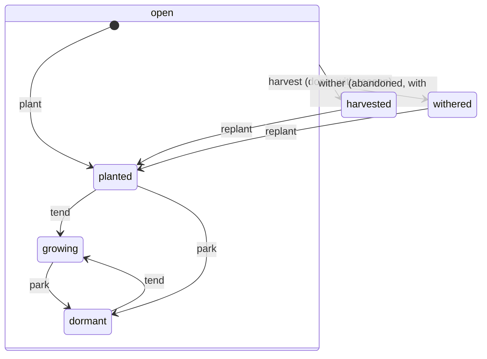

# Plan: the garden (seeds) — vertical slices

## Alignment

Stage 3 of the **home–garden–crew arc**
([docs/plans/2026-08-10-home-garden-crew-arc.md](2026-08-10-home-garden-crew-arc.md)),
which owns the sequencing around this plan: the home/outpost vocabulary,
the fence that keeps these slices home-only, the uplink that later unfences
outposts (and gates ticket retirement), and the central server. This plan
owns the garden itself.

First vertical through
[docs/vision/friendly-home-for-agents.md](../vision/friendly-home-for-agents.md):
the fine-grained, addressable work graph — **seeds** — for any attn-living
agent. Chosen over the crew primitive as the opening arc because the crew is
currently covered by the hand-run skill-layer simulation (`~/.attn/crew/`,
`/wake`, `/handoff`), which is teaching us the primitive's real shape before
we harden it; the garden is the machinery nothing simulates today. (The crew
was called "seats" until 2026-08-07 — the vision records the rename.)

Beads is the UX inspiration, not the spec. Where beads needs flags and
ceremony because its CLI is context-free, attn knows who is asking — the
daemon owns the session, its workspace, and its delegation — and the garden
leans on that everywhere. Aligned 2026-08-06: plots are seeds with children
(one primitive); `ready` infers its scope from the caller; **plans live in
the garden** (the crown's body is the plan, rendered and annotated natively);
packets (reusable templates) are designed into the schema now and implemented
last.

Slice-based, in the house style: every slice ships a usable behavior end to
end (CLI → daemon → app); no layer is built ahead of the slice that needs it.
Plant-and-see first, then expand.

The garden's first load is its own construction (aligned 2026-08-06, held
firm): this plan is planted as the first plot the day `plant` works, and
every slice tends and harvests itself as the CLI grows the verbs. Building
the garden without living in it would repeat the mistake the garden exists
to fix.

## Grounding (receipts)

- **Beads UX study, 2026-08-06** (per the vision's blindspot gate; UX
  only, storage explicitly not adopted).
  - Core loop: one-line capture; `ready` = no open blockers,
    auto-surfacing when a blocker closes; atomic claim; close-with-reason;
    audit trail in `show`; JSON everywhere.
  - Workflow layer (`docs/workflows/{formulas,molecules}.md` in the beads
    repo): a **molecule is just an epic** — parent with children plus
    execution intent, children parallel by default, only explicit
    dependencies sequence; `ready --mol` scopes to one molecule.
    **Formulas** are declarative templates (steps, typed variables with
    validation, human gates, cross-cutting aspects) cooked into template
    epics and poured into instances; **distill** extracts a template from
    a real epic that proved worth repeating; **bond** connects work
    graphs.
  - Dependency kinds — blocking: `blocks`, `parent-child`,
    `conditional-blocks`, `waits-for`; non-blocking: `related`,
    `discovered-from`, `replies-to`.
  - The one UX piece rejected: dotted hierarchical IDs — see design
    decisions.
- **Docstore is live** (A3 #745, A3.1 #748, revisions #753, A3.4 Stage 1
  positioned writes #766): namespaced collections, declared-field indexes,
  live queries, bus change events, per-document revisions with write
  expectations. The daemon may use `core/`. Stage 2 (windowed subscriptions)
  is designed but not started.
- **Markdown annotation surface exists**: attn natively renders a markdown
  file and routes user annotations to agents as feedback
  (`daemonMarkdownAnnotationEvents`, keyed `<op>:<workspaceId>:<path>`,
  last-writer-wins). Victor named this the target UX for reading and
  reviewing plans; slice 6 teaches it to render seeds. Foundational work on
  this surface is in flight and will reshape details — that slice is
  direction, not frozen design.
- **Crew simulation is live**: keel and alder exist, trellis joined
  2026-08-07; Keel filed the first real handoff 2026-08-06. The
  charter/handoff shapes are the reference for what seed-attached notes
  must carry.
- **Chief embryo**: `profile_roles` single-holder table, chief guidance
  injected at launch, ticket role identity. The chief is out of scope here —
  both its garden role and the chief→crew migration ride the crew vertical,
  after the simulation has taught us the primitive.

## Design decisions (cross-slice)

### Storage and shape

- **Docstore, `core/garden` namespace.** Collections `seeds` and `notes` —
  notes keyed by seed id in their own collection, so a long-tended seed
  never bloats its own document. Live queries, bus change events, and
  revision-checked writes come free; schema can move fast while the shape
  settles. Single-writer invariants (one active tender) are enforced in
  daemon code, the `applyState` way — not by table constraints.
- **Notes are the seed's history, written to the next tender** (Victor,
  2026-08-10). Not just machine audit: an agent writes what happened and
  what it learned, addressed to whoever tends the seed next. A note scoped
  to the whole effort goes on the crown — no extra machinery, a crown is a
  seed.
- **The read side is part of the surface** (Victor, 2026-08-10). Notes
  appear where the tender already looks: `show` includes the seed's recent
  notes and, when the seed sits in a plot, the crown's — never behind a
  verb nobody is told to run. The default shows the most recent few and
  names what it withheld ("12 more — `attn seed notes <id>`"); the full
  list is pageable and filterable. A silent truncation here recreates the
  unread bulletin board this surface exists to replace. Prose quality for
  crown bodies and notes is an open problem outside this plan's scope —
  the gate designed for it died in calibration
  ([the first-principles record](2026-08-12-plain-agent-prose-first-principles.md)).
- **One primitive.** A **plot** is a seed with children and execution
  intent; its root is the **crown**. A **packet** is a plot flagged as
  template. No separate entities, no separate lifecycles: plot-blocks-plot
  is an edge between crowns, and everything that works on a seed works on
  all of them.

```text
plot ─ the whole subtree, addressed by its crown's id
crown s-a1b2c3           body = the plan
├── s-d4e5f6   step: schema
├── s-g7h8j9   step: verbs     blocks → s-k1m2n3
└── s-k1m2n3   step: panel
```

- **IDs are identity.** Ruled in slice 1 (2026-08-12): `s-` plus six
  Crockford base32 characters (`s-7k3f9m`).
  - The alphabet drops `i`, `l`, `o`, `u`, so no two characters are
    confusable read aloud or copied by hand; six of them is 2^30 ids,
    which nothing a single garden holds comes near.
  - Minted from crypto/rand, not derived from the title — a derived id
    renames itself when the title is corrected.
  - No `/` in the alphabet, so qualifying an id at a federation boundary
    stays a prefixing job (`<daemon-id>/<local-id>`), never a
    re-identification.
- **Edges are structure.** No dotted hierarchy: re-parenting a seed must
  never rename it. `part-of` edges carry what beads encodes in ids. Within
  a plot, a seed's **step slug** (auto-derived from title, editable,
  unique in its plot) is what packets, bond points, and narrative
  cross-references name — it survives sowing.

### One garden, and the server

- **One garden, at the hub.** The garden lives in the hub daemon's
  docstore — the daemon the app talks to. A garden per daemon is a split
  brain: a remote delegate asking its own daemon would see an empty
  garden, and remotely planted seeds would never reach the panel. A remote
  session's seed commands reach the hub's garden over the relay, as an
  inverted request/response on the existing relay connection — ruled by
  the 2026-08-09 central-server ground pass and recorded in
  [the arc plan](2026-08-10-home-garden-crew-arc.md). Cross-machine and
  offline syncing is real and wanted, and rides the central-server arc:
  hub-local is the honest first version, not the end state.
- **Server-ready, not server-dependent.** The future central server
  (closed, operated, optional) must bolt on without a rewrite. Exactly two
  pre-commitments touch these slices; everything else is deferred whole.
  - **Ids are daemon-prefixed at the boundary.** The stored id is short
    and unique within its hub; the qualified form `<daemon-id>/<local-id>`
    is minted only where an id leaves its daemon (the server, cross-hub
    references, recognition routing) — inside a daemon, no operation ever
    sees the prefix. Uniqueness holds by construction: the daemon mints a
    persistent identity at first launch (`daemon-id` in the data root,
    `internal/daemon/instance_id.go`), each hub's docstore holds only its
    own garden, and the docstore id charset forbids `/` (verified
    2026-08-06 in `internal/store/documents.go` `PutDocument`), keeping
    qualified forms out of local storage by force. A sayable alias for the
    daemon id ("home", "work") is a ground-pass detail: the minted id is
    the spine, the alias the face.
  - **Garden bus facts stay complete enough to serve as a change feed.**
    Each fact names its seed, so a future sync engine is just a durable
    bus consumer with a cursor that re-reads the document and pushes it.
    Remote writes flow through the hub (the server acts as a client, like
    the app), so no slice needs merge logic, ever. Cross-hub visibility is
    a **union routed by prefix, never a merge**: identity collisions are
    impossible by construction, and every seed has one home hub that
    applies its writes. Roles/crew join seeds in the future sync scope.

### Scope and lifecycle

- **Plots are the only grouping (ruled 2026-08-13, superseding "every
  seed belongs somewhere").** The workspace stamp recorded which
  checkout the planter stood in, and every production workspace turned
  out to be a worktree of the same project — the stamp scattered one
  project's ideas across checkouts. Receipt and priced options:
  [the scope rethink](2026-08-13-garden-scope-rethink.md). The garden
  is one space; standing plots ("attn", "home") play the area role as
  ordinary crowns. The seed schema's `workspace_id` field retires in
  slice 5, before any production install holds seed data. Directory
  claims on plots (buying the zero-flag inference back) stay shelved
  until flag-typing actually stings.
- **`ready` infers its scope from the caller.** The daemon knows the
  session: a delegation dispatched at a crown sees its plot's ready
  seeds; an interactive session sees the whole garden (per the
  2026-08-13 scope ruling). `--plot` narrows; `--workspace` retires
  with the stamp. Ready = no open `blocks` edges, not dormant, no live tender,
  not a template, and — once gates exist — not a gate. Truth at query time;
  nudging a tender when its blocker falls is named-later work.

### Plans and review

- **The crown's body is the plan, and the crown is authoritative.** Seed
  bodies are markdown from slice 1. A chunk plan is a plot: alignment,
  receipts, and design decisions live in the crown's body; the children
  are the ledger. The plan and its checkboxes cannot drift because the
  checkbox *is* the seed.
- **The plot is the single source of truth from the moment it is planted**
  (decided 2026-08-06). `attn seed export <crown>` renders the body plus
  the child ledger as a checklist to a markdown file stamped *generated
  from crown `<id>` — edit the crown, not this file*; the existing
  annotation surface (keyed by workspace file path) works on that export
  unchanged. The review loop runs from day one — export → open → annotate
  → feedback reaches the tending agent → it adjusts the crown → re-export
  — so slice 6 deletes the export step from a working loop instead of
  debuting a new flow. `docs/plans/` keeps visions, gate records, and
  history.

### Templates, humans, agents

- **Template-ready schema, implemented last.** Carried from slice 1 so
  nothing migrates later; inert until their slices: `template` (flags a
  packet; excludes the subtree from ready and active views), declared
  variables on a packet's crown (name, description, required, default,
  pattern/enum; `{{var}}` interpolation in titles and bodies at sow time),
  the `sown-from` provenance edge, and `gate` (a gate seed never enters
  agent ready — when unblocked it opens a **turn**, riding attn's existing
  attention system instead of a bolted-on approval table).
- **The human tends the gardeners, not the seeds.** Seeds are tended by
  agents; Victor steers the agents and only occasionally (~5% of the time)
  adjusts a plan by hand. The garden owes the human capture (`plant`),
  visibility (the panel, `ls`, `show`), and judgment calls (what withers) —
  it must never demand tending ceremony from him.
- **A todo becomes a seed when it would survive the session.** Anything
  worth handing off, parking, or attributing gets planted; in-session
  scratch stays in the session. This norm lives in agent guidance, not
  schema — named here so it has a home, enforced nowhere.
- **Tending is atomic claim.** `attn seed tend <id>` sets tender + `growing`
  in one move (the beads `--claim` lesson). The tender is
  `{session_id, member?}` — member is the free-string crew-member name from
  the skill-layer simulation for now, snapping to member ids when the
  daemon primitive lands. Attribution is stamped from birth: every seed
  records its planter the same way.
- **Lifecycle vocabulary** (from the vision). Every door is two-way, every
  end carries a reason, and transitions are daemon-validated — an invalid
  transition names the seed, its state, and the ask. Only `tend` is
  guarded by the claim; `park`, `harvest`, and `wither` are fate calls
  open to anybody from any open state (the slice-2 ruling — a tender who
  walked away never locks a seed shut). The diagram matches the shipped
  matrix (`internal/garden/lifecycle_test.go`):



- **CLI-first, seconds to plant.** Agents live in the CLI; the app renders.
  Every command takes `--json`. Planting must cost one line and return the
  id.
- **Agents are primed, not left to discover** (the gap beads fills with
  hooks + AGENTS.md snippets; attn fills it at launch because it owns the
  launcher — the chief-guidance injection path is the donor). Two layers:
  a brief garden primer (vocabulary + the ready→tend→harvest loop) injected
  into any attn-launched agent's guidance once the garden is live, and
  context priming at launch — an interactive session learns the garden's
  ready count (repointed from the workspace's by the 2026-08-13 scope
  ruling; slice 5 does the repointing); a delegate dispatched at a
  crown starts knowing its plot,
  its ready seeds, and the freshest handoffs. No agent should have to
  discover the garden exists.
- **Audit trail = revisions + notes + facts.** Docstore revisions record
  every mutation; notes carry the human/agent-authored trail; bus facts
  (`garden.planted`, `garden.tended`, …) drive projections. `attn seed show`
  assembles all three.

## Vocabulary

The working set, with the beads equivalent where one exists. The core
entries landed in `docs/glossary.md` in slice 1; this table keeps the
full set and the beads mapping.

| attn | meaning | beads |
|---|---|---|
| seed | the unit of work; one document, one id | bead / issue |
| the garden | all seeds; the space they live in | the issue database |
| plant | create a seed (one line, returns the id) | `bd create` |
| tend / tender | atomically claim a seed / whoever holds it | `--claim` / assignee |
| harvest | close as done, with a reason | `bd close` |
| wither | close as abandoned, with a reason | — (close, undistinguished) |
| replant | reopen a harvested or withered seed | reopen |
| park / dormant | deliberately pause a seed / the paused state | — |
| ready | no open blockers, no live tender — tendable now | `bd ready` |
| plot | a seed with children plus execution intent — the whole subtree | molecule (epic with intent) |
| crown | the root seed of a plot; plots have no id of their own, so the crown's id is how a plot is addressed | the molecule's parent bead |
| step slug | a seed's stable name within its plot; survives sowing | step id |
| packet | a plot flagged as template, with declared variables | proto (cooked formula) |
| sow | instantiate a packet, filling its variables | `bd mol pour` |
| cutting | extract a packet from a proven plot | `bd mol distill` |
| gate | a seed that needs a human; opens a turn when unblocked, never enters agent `ready` | `[steps.gate]` |
| note | trail entry on a seed; the seed's memory of itself, routed to nobody | comment |
| handoff | a note kind addressed to whoever tends the seed next | — |
| fruit / laurel | recognition attached to a seed | — |

## Slices

### Slice 1 — plant and see

Goal: an agent plants a seed in one line; Victor sees it in the app
immediately.

Ships:

- [x] `core/garden` collections registered. The seed document carries the
      full designed schema — status, markdown body, workspace, planter,
      tender, step slug, edges, and the inert template/vars/gate fields —
      even though only a slice of it is behaviorally live.
- [x] `attn seed plant "title" [-m body]` → prints the new id;
      `attn seed ls`, `attn seed show <id>`; `--json` on all three.
      Workspace stamped from the calling session's context.
- [x] Seed id shape decided and documented: short, stable, sayable, unique
      in its hub; the daemon prefix stays at the boundary (see the
      server-ready design decision — no local operation ever sees it).
- [x] App: a garden panel listing the workspace's seeds live (docstore
      change events; if the app-side subscription seam wants A3.4 Stage 2,
      ride a snapshot-projection until it lands — the panel's contract is
      "planted seed appears without a refresh", not a particular transport).
- [x] Bus facts `garden.planted` with the seed as subject.
- [x] Glossary: seed, plant, the garden, plot, crown, packet (the vocabulary
      lands together even though plots arrive in slice 5).
- [x] `attn seed export <crown>` writes the crown's body (plus the child
      ledger as a checklist, once children exist) to markdown stamped as
      generated — the review bridge until slice 6 deletes it.
- [x] The first planting is this plan: its crown (this document as the body)
      and one seed per remaining slice, the day `plant` works. Hierarchy is
      wired as the verbs arrive — edges in slice 3, plot semantics in
      slice 5 — and from slice 2 onward each slice is tended on start and
      harvested on completion.

Acceptance:

- [x] From inside a live session, planting takes one command and the seed is
      visible in the running app without user action.
- [x] `plant` → `ls` → `show` round-trips in JSON.
- [x] The garden contains the plan for the garden, visible in the panel.

### Slice 2 — lifecycle and tending

Goal: a seed moves through its life, and the trail is visible.

Ships:

- [x] `attn seed tend <id>` (atomic claim), `park`, `harvest -m`,
      `wither [-m]`, `replant` — every transition daemon-validated with loud
      errors. The claim is guarded on `tend` alone (2026-08-12): the other four
      are fate calls, and guarding them would make a tender whose session ended
      a one-way door with no key.
- [x] `attn seed note <id> -m` appends to the trail; `show` renders states,
      tender, and notes newest-first. `show` renders the newest
      `garden.ShowNotes` and names what it withheld; `attn seed notes <id>`
      reads the whole trail.
- [x] App panel shows state and tender; state changes arrive live.
- [x] Bus facts per transition (`garden.tended`, `garden.harvested`, …), plus
      `garden.noted` for the trail.
- [x] Slice 1's seed-list cap finished (Victor, 2026-08-12): the count the push
      already carried now has consumers — the panel says how many the garden
      holds when it outgrew one push, and `attn seed ls` names how many seeds it
      did not show.

Two tenders are the same holder when their session ids match; with no session id
the crew name is the identity (2026-08-12). A terminal pane runs with no
`ATTN_SESSION_ID` by design, so `--member` is how a person in a pane claims a
seed, and comparing sessions alone made every one of them the same person —
live verification handed alder a seed trellis was holding.

Acceptance:

- [x] Full life in CLI: plant → tend → note → harvest, then replant → wither;
      each state visible in the app as it happens.
- [x] A second session trying to tend an actively-tended seed gets a loud,
      named refusal (and a `--steal` style override is deliberately absent
      until needed).

### Slice 3 — edges and ready

Goal: seeds relate, and "what can I do now" is one flag-free command.

Ships:

- [x] `attn seed link <a> blocks <b>` and `attn seed link <a> part-of <b>`
      (typed edge list on the seed document; new kinds — `sown-from`,
      `discovered-from`, `relates-to` — are additive), with `unlink`.
- [x] `attn seed ready` with inferred scope: the calling session's workspace
      by default; `--plot <crown>`, `--workspace <id>`, `--all` override.
- [x] `attn seed ls --tree` renders `part-of` hierarchy; `show` lists edges
      both directions (blocks / blocked-by).
- [x] Harvesting a blocker makes the dependent ready at the next query (no
      nudge yet — named later).
- [x] Priming, interactive side: attn-launched sessions receive the brief
      garden primer and their workspace's ready count in guidance (the
      chief-guidance injection path).

Three rules decided while building this (2026-08-12):

- A seed something is `part-of` is never itself ready. A crown's work is its
  children, so a plot with open children would otherwise hand out the crown
  and every leaf at once. A crown is finished by harvesting it, not by
  tending it, so this holds even after its children close.
- A seed sits in at most one plot. The second `part-of` is refused naming the
  plot it is already in and the `unlink` that moves it, rather than making
  "which plot is this in" a list.
- A live tender holds its seed, and liveness is "a session this daemon still
  knows" — including `recoverable`, which answers the open question below.
  A tender that names only a crew member always holds: attn has no signal
  that a person in a terminal pane walked away, and handing their seed to
  somebody else on a guess is worse than leaving it claimed.

Acceptance:

- [x] A three-seed chain (A blocks B, B part-of C) round-trips: `ready`
      shows only A; harvesting A surfaces B.
- [x] Two sessions in different workspaces get different flag-free `ready`
      answers.
- [x] Cycle creation is refused loudly, naming both seeds.

### Slice 4 — the seed axis of continuity

Goal: whoever next picks up a seed inherits the notes — the vision's
two-axis rule, seed side.

Ships:

- [x] A note kind `handoff`: `attn seed note <id> -m --handoff` (or
      equivalent flag) marking "written to my successor on this seed".
- [x] `attn seed show` surfaces the freshest handoff note prominently;
      `tend` prints it on claim so pickup primes automatically.
- [ ] The `/handoff` skill (crew side) gains one step: for each seed you
      tended and are not harvesting, leave a seed handoff note. Member
      homes stay untouched otherwise — the axes are additive. *Lands
      outside this repo: the skill is in the maintainer's user config, so
      it does not ride a repo PR.*

One rule fixed while building this (2026-08-12): `ready` and `tend` decided
"is somebody holding this" separately, so a seed whose tender's session had
ended was offered by `ready` and then refused by `tend` — naming a session that
no longer exists, which is an answer nobody can act on. It is also exactly the
wall this slice hits, since leaving a handoff and ending is what a successor
picks up from. Both now read `Tender.Holds`.

The handoff is not on the wire Seed and so not in the panel: the plan gives
slice 4 no app line, and the panel renders no notes of any kind today. Whichever
slice teaches it the trail teaches it handoffs in the same move.

Acceptance:

- [x] Session A tends a seed, files a handoff note, ends. Session B (a
      fresh errand) runs `tend` and the note is in its face before any
      work.

### Slice 5 — plots and dispatch

Goal: real work flows through a plot — plant a chunk as a crown with
children, dispatch a delegation at it, watch it drain.

Ships:

- [ ] Planting under a crown: `attn seed plant --part-of <crown>` (or a
      `plot` convenience that plants crown + children in one JSON payload
      for agents).
- [ ] Dispatch-at-plot: a delegation carries its crown; inside it,
      flag-free `ready` scopes to the plot; children are parallel by
      default, only `blocks` edges sequence.
- [ ] Priming, delegate side: a delegate dispatched at a crown launches
      already knowing its plot (crown body summary, ready seeds, freshest
      handoffs) — it never has to ask what it was sent to do.
- [ ] App: the panel groups a plot's seeds under its crown and shows
      progress (done / growing / ready / blocked counts).
- [ ] `attn seed show <crown>` includes plot progress; a stale-plot query
      (`attn seed ls --stale`) exists as a *query*, not an automatic reaper
      — a person (or later a crew member) decides what withers.
- [ ] The scope ruling lands: the `workspace_id` stamp and the
      `--workspace` flag retire from plant/ls/ready; flag-free
      interactive `ready`/`ls` answer for the whole garden; the panel
      defaults to whole garden with its toggle scoping by plot; launch
      priming speaks of the garden, not "your workspace's ready count".

Acceptance:

- [ ] One real piece of work flows end to end in production use: a plot is
      planted, a delegate dispatched at it tends and harvests children in
      dependency order, the panel shows it draining live.
- [ ] Two delegates on one plot pick up parallel children without collision.
- [ ] A fresh session re-orients from `ready`/`ls` alone (garden state lives
      in the daemon, not in anyone's context).

### Slice 6 — the plan lives in the garden

Goal: read and review a plot the way markdown plans are read today —
rendered, annotated, feedback flowing to the tending agent.

Rides Victor's in-flight foundational work on the rendering/annotation
surface; this slice is direction, not frozen design — re-align before
building it. By this point the export loop has been proving the review flow
since slice 1, so this slice removes the export step from a working loop
rather than debuting a new one.

Ships:

- [ ] The markdown rendering + annotation surface learns a second document
      source: a seed. The crown's body renders as the plan page; children
      appear as the live ledger beneath it.
- [ ] Annotations on a rendered seed route as feedback to its tender's
      session (the existing annotation→agent path); on an untended seed
      they land as notes on the trail, so review feedback is never lost.
- [ ] A chunk plan authored as a plot replaces its would-be
      `docs/plans/*.md` file for one real chunk — the first plan that never
      touches git.

Acceptance:

- [ ] Victor opens a crown, reads the plan, annotates a paragraph, and the
      tending agent receives the feedback — no export, no file.
- [ ] The same plot's ledger updates live while he reads.

### Later (named, unplanned)

- **Packets: sow and cutting** — the template flag, declared variables,
  interpolation, `sown-from` provenance, and `cutting` extraction (taking a
  packet from a proven plot, as a gardener takes a cutting from their best
  plant; beads calls this distill). The first packet candidate is already
  visible — Victor's canonical chunk shape (2026-08-07): implement steps →
  crew review → human gate, the gate riding gates-as-turns. The
  schema is carried from slice 1; the behavior ships when a real plot shape
  has repeated and earned its packet.
- **Gates as turns** — `gate` seeds opening turns when unblocked; the
  schema field exists from slice 1.
- **Tickets retire** (decided 2026-08-06; supersedes "tickets as views").
  There will be no era of two capture systems: the garden takes over as
  soon as it is usable — slice 5 (capture + dispatch) is the bar — and
  tickets are then removed, not kept as a parallel board.
- **Laurels attach to seeds** — the recognition arc; seed ids are the
  attachment points, nothing in this plan blocks it.
- **Ready nudges** — waking a tender when its blocker falls (doorbell path).
- **No seed comments — deliberately** (decided 2026-08-06). A comment is a
  message with no addressee: too noisy to be a good trail note, too
  undirected to be a good message. Notes are the seed's memory of itself and
  route to nobody; conversation between agents is the vision's "agents
  converse and observe" rock — directed, daemon-brokered messages that can
  address a seed's participants as routing sugar, plus passive inspection
  the daemon serves. Ticket comments cover the meantime. If slice 5's
  multi-delegate reality demands seed-scoped chat before messaging lands,
  that evidence reopens this — speculation does not.
- **Seed priming at wake** — the `/wake` skill reading the waking member's
  tended seeds; belongs to the crew arc.
- **Daemon crew primitive** — hardened from the skill simulation's lessons;
  the chief→crew migration and the chief's garden-tender role both ride it.
- **Crew memory condensation** — deferred with a tripwire per the vision:
  priming size is logged from the simulation's first days; the lossless-claw
  DAG gets built when a real member overflows a measured budget.
- **Central server / cross-daemon recognition** — behind its ground pass.

## Non-goals

- Yegge's beads tool, Dolt, or git-based storage — UX inspiration only.
- Dotted hierarchical ids.
- Automatic fate derivation (a seed withers because someone says so).
- Replacing or migrating tickets in this plan.
- Priority fields, deadlines, or any scheduling metadata — until real garden
  use shows the need, seeds order by readiness and human judgment.
- Formula aspects, bond points, conditional-blocks, waits-for — named in the
  beads study, adopted only if real plots demand them; the additive edge
  list and step slugs keep the door open.
- Multi-human features.

## Open questions

- Crew references: free-string member names are knowingly un-validated
  until the crew primitive lands — acceptable for a single-user garden,
  revisit at the crew arc.
- The crown/plot naming is Victor-blessed as of 2026-08-06 pending better
  ideas; the glossary entry in slice 1 is the commitment point.
- How slice 6's annotation keying generalizes from `<workspaceId>:<path>` to
  seed ids — designed with the foundational rendering work, not before.
- Vocabulary fluency: `harvest` is the hardest word to sight-read (Victor,
  2026-08-06) — expected to grow with use; revisit the name if it does not.
  Agents get a brief vocabulary primer in guidance; no heavier mechanism.
- Whether extensions (plugins/SDK) may read or write the garden, and through
  what grant — `core/garden` is daemon-owned today, and the vision's
  bespoke-crew rock will eventually want a door. Not needed for these
  slices; named so the namespace choice doesn't silently decide it.

## Ruled

Questions this plan opened and later closed, newest first. The ruling is
the current truth; the original question is kept for the record.

- **Panel transport → classic snapshot projection** (ruled 2026-08-12,
  with the code in front of us). The docstore's live-query surface is
  IPC-only (`handleDocSubscribe` speaks over `net.Conn`) and the app
  speaks WebSocket, so riding it meant building the app-side subscription
  seam first — A3.4 Stage 2's whole scope — to deliver a list of at most a
  few hundred small documents. `garden.planted` projects to one
  `garden_seeds_updated` push carrying the whole garden, coalesced like
  every other snapshot; the panel scopes to its workspace client-side.
  Revisit when the garden outgrows one push, not before. The panel is the
  first rendering, not a commitment — whether the garden becomes the app's
  front door is a named question in the vision.
- **`ready` and a recoverable tender** (ruled 2026-08-12): a session the
  daemon still knows holds its seed, `recoverable` included — revive
  brings that session back to the seed it was tending, and releasing it
  meanwhile would hand the work to somebody else while its tender is on
  the way back. A session the daemon no longer knows releases it. See
  slice 3's rules.
- **Remote sessions reach the hub's garden over the relay** (ruled
  2026-08-09 by the central-server ground pass): an inverted
  request/response over the existing relay connection — the remote daemon
  pushes an intent event to its connected hub-kind client; the hub applies
  and the result returns — with a loud refusal when no hub is connected.
  Recorded in [the arc plan](2026-08-10-home-garden-crew-arc.md). Still to
  build before slice 5's dispatch acceptance can include a remote
  delegate; cross-machine syncing proper stays with the central-server
  arc.
- **Ticket retirement vs. ticket comments** (ruled 2026-08-06): messaging
  accelerates. The converse-and-observe vertical (peek + msg) lands before
  the garden's build starts, so tickets retire only when both hold —
  garden usable (slice 5) and messaging live. (It shipped; see its plan.)
