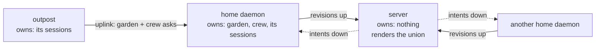
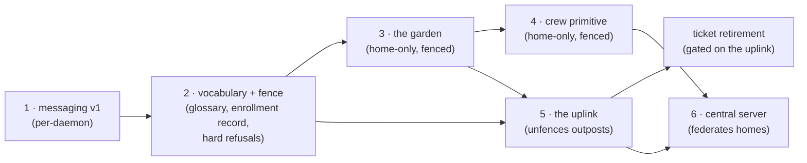
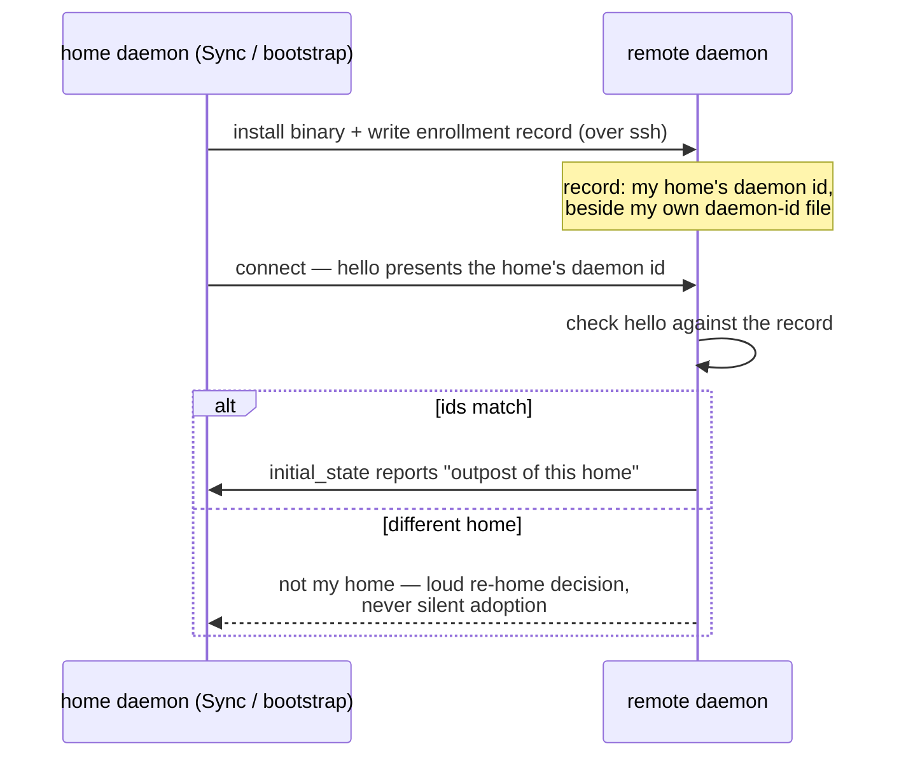
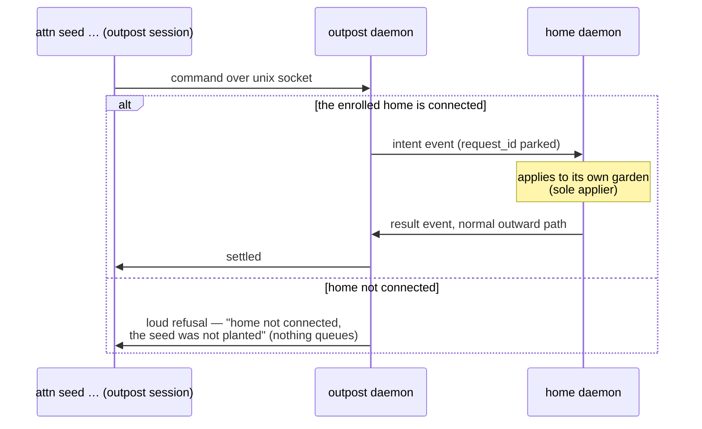
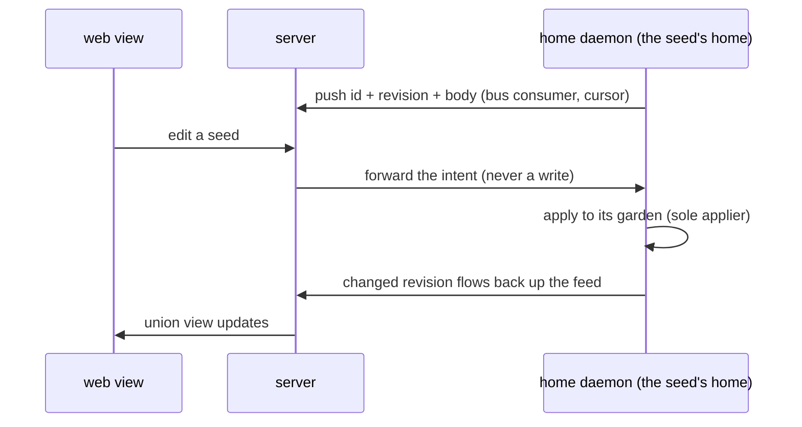
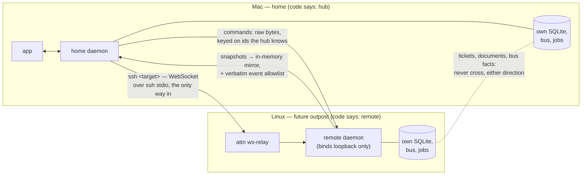

# Plan: the home–garden–crew arc

Spine plan for the arc that takes attn from single-daemon sessions to a
crewed, multi-machine home: agent messaging, home daemons and outposts, the
garden, the crew primitive, the uplink, the central server. Stage detail
lives in the stage plans — [messaging](2026-08-08-converse-and-observe.md),
[the garden](2026-08-06-the-garden-vertical-slices.md), the crew plan when
it is written. This doc owns what none of them can: the vocabulary, the
sequencing, the fence, and the server.

`docs/glossary.md` owns the terms (home daemon, outpost, enrollment). The
server stances already ruled — closed source, operated by Victor,
optional-never-required, sole-applier, union-by-prefix never merge, API-key
auth — are taken as given.

## Concepts

**One owner per piece of state.** Ownership is per kind of state, never per
machine rank; everyone else is a client of the owner.

| state | owner | everyone else |
|---|---|---|
| sessions, PTY, local tickets | the daemon they run on | live in-memory mirror at the home, discarded on disconnect |
| the garden, the crew | the home daemon | outposts ask over the uplink; nothing flows down, reads included |
| the cross-home union | nobody — it is a view | the server renders it, routed by daemon prefix, and writes nothing |

**Every daemon has exactly one home.** A **home daemon** is standalone and
complete — it owns its garden and crew, every fresh install starts as one,
and the user's app talks to one. An **outpost** is a daemon enrolled to a
home: it keeps its own sessions and passes garden and crew asks upward.
**Enrollment** is the recorded, mutual act: the outpost persists its home's
daemon id (`d-<32 hex>`, `internal/daemon/instance_id.go:66`). A second
home dialing an enrolled outpost is a loud re-home decision, never silent
adoption.

**The uplink is one generic channel.** Outpost-asks-home: an intent
envelope with a kind, sent over the relay connection the home already
dialed, answered with a result. Seeds are its first rider; cross-daemon msg
and peek ride the same channel later. Never a bespoke path per feature.

**Home↔outpost is ownership; home↔server is federation.** The server
connects home daemons to each other and owns nothing. Outposts never meet
the server; a home represents its whole fleet.

## The arc

### Stage 1 — messaging v1 (per-daemon)

[2026-08-08-converse-and-observe.md](2026-08-08-converse-and-observe.md),
build-ready: peek then msg, both sessions on one daemon. Message state is
daemon-local by design — no split-brain risk, no fence needed. Cross-daemon
addressing errors as an unknown session until it rides the uplink.

### Stage 2 — vocabulary and the fence

The stage that makes deferral safe. Small; lands before or with the
garden's first slice.

- [x] Glossary: home daemon, outpost, enrollment.
- [x] Bootstrap writes the **enrollment record** on the remote — the home's
      daemon id beside the outpost's own `daemon-id` file, same flock
      mechanics. Bootstrap already installs files there, so this is the
      cheapest first slice of enrollment, and it is exactly what the
      uplink will check later. It writes it by running
      `attn enrollment enroll --home <id>` over ssh, so the record's rules
      live in one place (`internal/enrollment`) rather than in a shell
      script that would drift from them.
- [x] The daemon reads the record at start and reports "outpost of its
      home" in health and `initial_state`. It re-reads on every ask, so
      `attn enrollment leave` and a sync take effect without a restart.
- [x] A fence helper: garden and crew surfaces call it and, on an outpost,
      fail hard with a named error — the home's id, where the garden
      lives, and a pointer to this plan. The fence *is* the tracking.
      `enrollment.Status.RequireHome`, reached from the daemon through
      `Daemon.requireHome`; an unreadable record fails it closed.
- [x] Re-home: bootstrap against a remote enrolled to a different home
      stops and asks, never overwrites. The ask is answered on the
      outpost — `attn enrollment leave` makes it a home again, and the
      second home's sync then enrolls it.

Explicitly unchanged: everything outposts do today — sessions, PTY, PR/git
flows, local tickets.

### Stage 3 — the garden (home-only, fenced)

[2026-08-06-the-garden-vertical-slices.md](2026-08-06-the-garden-vertical-slices.md)
as planned, entirely at the home daemon. Seed ids stay
fully-qualified-ready: `<daemon-id>/<local-id>` minted only at the
boundary; the docstore id charset forbids `/`
(`internal/docstore/docstore.go:307`), so qualified forms cannot leak into
local storage. A seed command on an outpost hits the stage-2 fence.

**Ticket retirement is gated on the uplink, not just on "garden usable".**
Every delegation is ticket-tracked, including on outposts, and outpost
tickets are daemon-local — retiring tickets while outposts are fenced
would strand outpost delegations. "No two-system era" holds at home; the
retirement pass waits for stage 5.

### Stage 4 — the crew primitive (home-only, fenced)

The crew hardens from the hand-run skill simulation into the daemon, at the
home, behind the same fence: identity, charters, handoffs, and wake priming
are home-owned state. A member's *sessions* may run on an outpost — sessions
stay outpost-owned — but the member lives at home. Detail owed in its own
plan; this stage pins its place in the sequence.

### Stage 5 — the uplink (unfences outposts)

- The outpost daemon pushes an intent envelope (kind, payload,
  `request_id`) to the connected client whose hello presents its enrolled
  home's id; the home applies against its own store and answers over the
  normal outward path; the outpost settles the parked CLI request — the
  `browser_control` promise-parking pattern, mirrored
  (`internal/hub/manager.go:1065-1140`).
- The enrollment check is a correctness guard against accidental
  cross-homing, not cryptography; the adversarial boundary stays the SSH
  key, as everywhere else.
- Home not connected → loud refusal, nothing queues.
- Riders, in order: seed commands (unfencing stage 3), cross-daemon
  msg/peek (extending stage 1), ticket retirement's outpost leg.
- Price: protocol bump, intent/result messages, routing on both daemons,
  the enrollment check. No new transport, no new auth, no new machinery
  class.

### Stage 6 — the central server (federates homes)

- **Each home dials the server**: one outbound WSS connection, minted API
  key from config. NAT-friendly; the server never needs a path into
  anyone's machine. Outposts never connect.
- **Up: a durable bus consumer on the home** with a persisted cursor — on
  each garden fact, re-read the document, push id + revision + body.
  At-least-once with resume is the bus's existing contract
  (`internal/bus/bus.go:14-19`); the server dedupes on revision. No
  field-by-field diffing, ever — the revision is the truth.
- **Down: intents, not writes.** The server forwards a mutation intent to
  the seed's home; the home applies; the change flows back up the feed.
- **v0 scope**: garden mirror (read/web view) + recognition routing
  (laurels to a member on another home land at that home's next
  connection). Single user, one key per home, no rotation ceremony.
  Server code lives in its own closed repo.
- **v0 does not do**: multi-master, merge, offline mutation queues beyond
  bus retention, agent control from the web, or cross-home visibility
  *inside* a home (the union exists only at the server; an in-home view of
  another home's seeds would be a read-only mirror added on evidence,
  never a second writer). The sole-applier stance means none of these
  requires a schema change later.
- attn-side surface: a `server` config block (URL + key), the outbound
  client, the bus consumer, `attn server status` beside `attn bus status`
  (cursor + connection state are the whole health story; `attn bus
  disable` already covers runaway-sync emergencies).

## Ground: what exists today (receipts vs main `2b65761d`, 2026-08-09)

**Topology — the hub dials, always.** An endpoint is an SSH target in the
hub's `endpoints` table (`internal/store/endpoints.go:24-32`). The hub
spawns `ssh <target> … attn ws-relay` and speaks WebSocket through the ssh
child's stdio (`internal/hub/transport.go:42-92`); `ws-relay` is a byte
pump into the remote daemon's loopback-only WS server
(`cmd/attn/main.go:560-575`). The remote never initiates and has no
reachable listener. Endpoints are app-managed only — no CLI surface.

**Relay — outward commands, mirrored events.** App commands are forwarded
as their original raw bytes, keyed on ids the hub already knows
(`internal/daemon/websocket.go:1383-1471`, `internal/hub/manager.go:1047-1063`);
the routing principle is stated at
`internal/daemon/websocket.go:1326-1416` — a command forwards when the
state it mutates lives in the owning daemon's store. Events come back
re-composed into an in-memory mirror, plus a verbatim allowlist
(`internal/hub/manager.go:791-828`) into `broadcastRawWSMessage`
(`internal/daemon/websocket.go:1811`), the enumerated bus exception
(`internal/daemon/bus.go:50-52`). The one request/response precedent —
`browser_control` (`internal/hub/manager.go:1065-1140`) — is hub-initiated
like everything else.

**Identity — daemon yes, session no.** Every daemon mints a durable
`d-<32 hex>` id under an flock (`internal/daemon/instance_id.go:66`)
and sends it in `initial_state` (`internal/daemon/websocket.go:772-773`).
"Hub" is unmodeled: the relationship lives only in the hub-side
`endpoints` table; the remote persists nothing, and `ClientKind: "hub"` is
an unverified self-declaration it ignores
(`internal/hub/manager.go:593`). Session ids are bare UUIDs resolved
across endpoints by first-match scan — no namespace, no collision
detection (`internal/hub/manager.go:901-913`).

**Auth — the SSH key is the whole boundary.** `ATTN_WS_AUTH_TOKEN` is
default-empty, enforced only when the remote sets it, and not forwarded in
the env the hub exports over ssh (`internal/hub/ssh.go:37-65`,
`internal/daemon/websocket.go:655-660`) — a no-op in practice. No API-key
store, no rotation, no per-endpoint credential anywhere. The server is the
first component that needs real authentication; there is nothing to reuse.

**Coherence.** Protocol mismatch hard-drops and retries on a slow 30 s
loop (`internal/hub/manager.go:645-647,519-529`). Fingerprint mismatch
keeps the connection with status `binary_mismatch`
(`internal/hub/manager.go:652-655,1811-1837`); the real gate is the
frontend refusing new sessions on any endpoint not `connected`
(`app/src/App.tsx:2076`). The user's Sync click is the sole path that
reinstalls a running remote (`internal/hub/manager.go:272-289`).

**Nothing sync-shaped exists.** The remote mirror is in-memory,
wholesale-replaced per snapshot, emptied on disconnect
(`internal/hub/manager.go:73,1142-1159,1195-1210`). Equality is the
hand-maintained `sessionsMatch` (`internal/hub/manager.go:1352-1382`),
whose comment trail records real omitted-field bugs. The bus is
per-daemon: durable consumers hold a cursor in their own SQLite
(`internal/bus/bus.go:90-108`); nothing correlates two daemons' buses.

**Stores are complete and private.** No ticket, notebook, document,
automation, or workflow command routes remotely, and none of their events
are relayed. `attn ticket` on a remote writes to that machine's SQLite;
the hub never learns. This is the split brain the garden's one-home stance
exists to avoid.

## Decisions

- **Fence, don't pay early** (Victor, 2026-08-10): seeds and crew land
  home-only; outposts refuse with a named error until the uplink exists.
  Tracking is this plan plus the fence errors pointing at it; stage 2's
  record and id readiness make stage 5 purely additive.
- **"Outpost"** (Victor, 2026-08-10), over field/enrolled/remote daemon.
- **The uplink is generic** (2026-08-10): seeds, msg, peek, and ticket
  retirement's outpost leg are riders, never bespoke paths.
- **Home↔outpost is ownership; home↔server is federation** (Victor,
  2026-08-10): the server connects home daemons and owns nothing.
- **Loud refusal over local queueing** when home or a server peer is
  unreachable: a queue is a second sync engine, refused without evidence.
- **Enrollment before the uplink**: building the channel first would
  hard-code "whoever connected first is my home."
- **The garden plan's PR-flow analogy was backwards** (found 2026-08-09,
  corrected in place): PR flows travel home → remote, keyed on ids the
  home knows; seed commands need the opposite direction, which does not
  exist until the uplink.
- **Server transport is persistent WSS** (Victor, 2026-08-10), over polled
  HTTPS. Polling has no interval that is both quiet and alive: fast is
  idle burn, slow is a dead-feeling web UI, and either way it adds a
  second delivery rhythm to a push-shaped system. Reconnect/backoff is
  reuse of the hub's dial path, not new machinery; heartbeats are
  mandatory, not optional.
- **Stage 2 ships as its own PR** (Victor, 2026-08-10), not folded into
  garden slice 1.

## Absorbed surfaces (Victor, 2026-08-10)

Two existing surfaces fail the vision's names-its-reader principle and are
frozen for new construction now, retired once their absorbers land. Receipt:
workspace context was never written in 4 of 6 live workspaces; the two that
used it (revisions 40 and 20) were hand-maintaining crown-shaped documents —
Area / Current Picture / Threads / Timeline / Decisions — whose canonical
content already lives in plan docs. The Notebook's automated writers
(keeper, summarizer, compacter) are all turned off and nothing was missed.

| Job | Old home | New home |
| --- | --- | --- |
| What is happening right now | workspace context | `agent peek` / `agent list` (stage 1) |
| Tell another session something | workspace context | `agent msg` (stage 1) |
| Effort-level current picture and plan | workspace context, Notebook | the crown's body (stage 3) |
| Historical context: what happened, what was learned | workspace context, Notebook journal | notes on the seed, or on the crown when effort-scoped — a crown is a seed, so this needs no extra machinery (stage 3) |
| Delegation artifacts | Notebook | the seed's page (stage 3) |
| Durable knowledge | Notebook | repo docs and glossary, as today |
| Continuity of perspective | Notebook journal | crew handoffs (stage 4) |

Notes are the general agent-facing historical-context surface, not a
machine audit trail: written by an agent to whoever tends that seed next —
anchored to the thing they are about and read at tending time, which is
what workspace context never had.

## Open forks

- Whether the server gets a product name (deferred; naming can happen any
  day before the server ships).

## Landmines named, not defused

- `sessionsMatch` hand-maintained equality: a new session field that skips
  it silently stops updating the mirror
  (`internal/hub/manager.go:1352-1382`). Revision-based sync avoids the
  class; the session mirror keeps the risk.
- First-match session resolution across endpoints: a UUID collision
  misroutes silently (`internal/hub/manager.go:901-913`).
- No endpoint CLI: a headless user cannot add an endpoint at all. Separate
  itch; the server arc trips on it the first time someone configures a
  home from a script.
