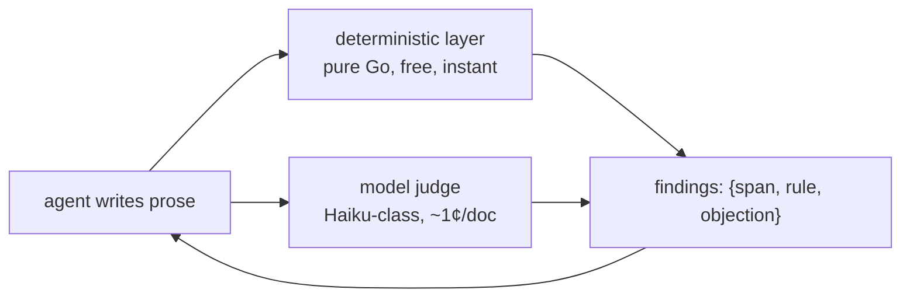

# Plan: the prose density gate

Agent-written prose drifts dense: long paragraphs, sentences doing three
jobs, loaded words, nominalized mush. Guidance alone has not held — the
comment-prose sweep (#818) measured comments ballooning from 6% to 17% of
the diff under style guidance that forbade exactly that. Trust but verify
(Victor, 2026-08-10): a detector reads what an agent wrote and reports,
in the writing loop, what to simplify and where.

The deliverable is always a **finding** — a quoted span, the objection,
and when possible a suggested rewrite. Never a score: an agent can fix
"this sentence does three jobs, split it"; it cannot fix "readability 32",
and score-shaped targets are documented to collapse prose into fragments
([RL against a readability score](https://arxiv.org/pdf/2410.17088);
Hemingway is the interactive version of the same failure).

## Shape

Two layers. The deterministic layer owns everything countable; the judge
owns everything semantic. The anti-gaming tripwires exist so an agent
optimizing one layer lands in the other's findings.

### Deterministic layer (pure Go)

No Python dependency, ever (Victor, 2026-08-10): anything worth adopting
from the research gets a Go port; anything needing a real parser is cut.

- **Vale-shaped rule engine.** [Vale](https://vale.sh/) is a mature Go
  prose linter — markup-aware, production-proven (Datadog, Grafana), and
  its Vocab model (per-project accept/reject term lists) is exactly the
  user-curated loaded-word list. Embed it or mirror its style format so
  existing styles carry over; decided in slice 1.
- **Rules that survive technical prose**: nominalizations and hidden verbs
  ("give consideration to"), noun strings (3+ consecutive nouns), passive
  voice hiding its actor, expletive openers, the reject vocabulary, and a
  generous per-sentence length tripwire. Skipped as documented
  staccato-machines: adverb-phobia, blanket length bans, marketing-tone
  rules.
- **Idea density per sentence** — the metric that says *overloaded* rather
  than *long*: propositions per word, CPIDR-style (count verbs,
  adjectives, adverbs, prepositions, conjunctions over a POS tag pass;
  [receipt](https://link.springer.com/article/10.3758/BRM.40.2.540)),
  ported to Go over a pure-Go tagger
  ([jdkato/prose](https://pkg.go.dev/github.com/jdkato/prose)). Chopping a
  sentence moves words but deletes no propositions, so this number cannot
  be gamed by fragmenting.
- **Anti-gaming pair for the length rule**: a staccato detector (runs of
  consecutive sub-threshold sentences, sentence-length variance floor) and
  an adjacent-sentence referent-overlap check — chopped prose loses
  connectives and shared referents, so the cohesion check fires exactly
  when the length check is being gamed.
- **Cut**: composite readability formulas (blind to jargon, gameable,
  score-shaped), surprisal/perplexity (heavy runtime, measures
  unpredictability — which technical prose legitimately has), max
  dependency distance (needs a real parser; the judge covers it).

### Model judge

One narrow question per call, per paragraph — the granularity at which
Haiku-class judges hold up (cross-family agreement κ≈0.72 on
criterion-scoped judging; reliability collapses on "grade this document").
The reconcile classifier is the in-repo precedent: tool-less, cheap,
deterministic harness around a small model.

- Criteria, one per pass: sentence doing more than one job; paragraph
  with no through-line ("each sentence is fine, the paragraph is a
  maze"); loaded or hedging language where a plain word exists; choppy
  fragments that are one idea broken apart (the judge is the backstop
  against gaming the deterministic layer).
- Output is a capped list of `{quoted span, objection, rewrite}` — no
  scores (leniency drift), no pairwise comparison (verbosity and position
  bias live there). The user's reject vocabulary is injected into the
  rubric per run.
- Grounding for trusting the family at all: GPT-4-class readability
  judgments correlate r≈0.75 with humans, beating every formula and
  psycholinguistic index
  ([Trott & Rivière 2024](https://arxiv.org/abs/2410.14028)).

## Every threshold needs a receipt

No number in the deterministic layer ships from this plan. Calibrate on a
corpus labeled by Victor — prose he has judged good beside prose he has
judged dense (the #818 before/after diffs are a ready-made seed corpus) —
and set each tripwire past where the good prose goes. A legitimate
sentence hitting the gate means the threshold is wrong; remeasure.

## Where it runs

- **`attn prose check <file|->`** is the base verb: both layers, findings
  to stdout, `--json` for agents, `--deterministic-only` for the free
  tier. Everything else composes it.
- **Boundary moments, advisory**: agent guidance (embedded skill, crew
  charters) says to run it before presenting a plan doc, filing a crown
  body or handoff, or opening a PR whose body carries real prose. The
  findings go to the agent that just wrote the text — the one reader who
  can act, while the text is still cheap to fix.
- **Not a hard block anywhere** until the gate earns trust on real
  drafts; promotion to CI or a pre-file hook is a later decision, taken
  per surface.

## Slices

1. **Deterministic layer + CLI.** Rule engine decision (embed Vale vs
   mirror its format), the technical-prose rule set, idea density port,
   anti-gaming pair, calibration corpus and receipts, `attn prose check`.
2. **Judge.** Criterion passes, span-anchored output, vocabulary
   injection, cost and agreement spot-check against the corpus.
3. **Surface wiring.** Embedded-skill guidance, garden integration once
   crown bodies and notes exist ([the garden
   plan](2026-08-06-the-garden-vertical-slices.md) points here for its
   prose quality gate).

## Decisions

- **Both layers, not guidance alone** (Victor, 2026-08-10): trust but
  verify; #818 is the receipt that guidance drifts.
- **No Python dependency** (Victor, 2026-08-10): Go ports or cuts.
- **Findings, never scores** (2026-08-10): the feedback contract is a
  quoted span an agent can act on; scores drift and get gamed.
- **Advisory before blocking** (2026-08-10): the gate reports to the
  writing agent first; hard gates come per surface, with evidence.

## Open questions

- Embed Vale as a library vs mirror its style format with our own engine
  (slice 1 decides; embedding buys the ecosystem, mirroring buys control).
- Whether the judge rides the daemon (a job kind) or stays CLI-only until
  a surface needs it ambiently.
