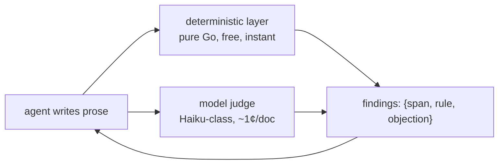

# Plan: the prose density gate

Agent-written prose drifts dense: long paragraphs, sentences doing three
jobs, loaded words, nominalized mush. Guidance alone has not held — the
comment-prose sweep (#818) measured comments ballooning from 6% to 17% of
the diff under style guidance that forbade exactly that. Trust but verify
(Victor, 2026-08-10): a detector reads what an agent wrote and reports,
in the writing loop, what to simplify and where.

The deliverable is always a **finding** — a quoted span, the objection,
and when possible a suggested rewrite. Never a score: an agent can fix
"this sentence does three jobs, split it"; it cannot fix "readability 32",
and optimizing against score-shaped readability targets is documented to
degrade the prose itself — disproportionate weight on sentence-level
readability rewards destabilizes training and lowers simplification
quality ([receipt](https://arxiv.org/pdf/2410.17088)), and
Hemingway-style length rules are the interactive push toward staccato.

## Shape

Two layers. The deterministic layer owns everything countable; the judge
owns everything semantic. The anti-gaming tripwires exist so an agent
optimizing one layer lands in the other's findings.

### Deterministic layer (pure Go)

No Python dependency, ever (Victor, 2026-08-10): anything worth adopting
from the research gets a Go port; anything needing a real parser is cut.

- **Vale-shaped rule engine.** [Vale](https://vale.sh/) is a mature Go
  prose linter — markup-aware, production-proven (Datadog, Grafana), and
  its Vocab model (per-project accept/reject term lists) is exactly the
  user-curated loaded-word list. Embed it or mirror its style format so
  existing styles carry over; decided in slice 1 — see Decisions, which
  records that every Vale package is `internal/` and only its Vocab format
  carried over.
- **Rules that survive technical prose**: nominalizations and hidden verbs
  ("give consideration to"), noun strings (3+ consecutive nouns), passive
  voice hiding its actor, expletive openers, the reject vocabulary, and a
  generous per-sentence length tripwire. Skipped as documented
  staccato-machines: adverb-phobia, blanket length bans, marketing-tone
  rules.
- **Idea density per sentence** — the metric that says *overloaded* rather
  than *long*: propositions per word, CPIDR-style (count verbs,
  adjectives, adverbs, prepositions, conjunctions over a POS tag pass;
  [receipt](https://link.springer.com/article/10.3758/BRM.40.2.540)),
  ported to Go over a pure-Go tagger
  ([jdkato/prose](https://pkg.go.dev/github.com/jdkato/prose)). Chopping a
  sentence moves words and propositions into both halves, so each half
  keeps roughly the density of the whole — measured at 0.03–0.09 lost per
  rewrite, against 0.17 of headroom (see Calibration receipts). Weak
  escape, not a free one, and the opposite of a length rule, which a split
  satisfies outright.
- **Anti-gaming pair for the length rule**: a staccato detector (runs of
  consecutive sub-threshold sentences, sentence-length variance floor) and
  an adjacent-sentence referent-overlap check — chopped prose loses
  connectives and shared referents, so the cohesion check fires exactly
  when the length check is being gamed.
- **Cut**: composite readability formulas (blind to jargon, gameable,
  score-shaped), surprisal/perplexity (heavy runtime, measures
  unpredictability — which technical prose legitimately has), max
  dependency distance (needs a real parser; the judge covers it).

### Model judge

One narrow question per call, per paragraph. The cited ground: small
models judge adequately on narrow, closed-ended rubrics but not on
open-ended quality ([SLMJury](https://arxiv.org/html/2606.07810)). That
Haiku-class agreement is *sufficient* at this granularity is a working
assumption, not a received fact — slice 2 measures it on our own corpus
before the judge is trusted, and the criterion-scoped design is what
makes that measurement possible per criterion.
The reconcile classifier is the in-repo precedent: tool-less, cheap,
deterministic harness around a small model.

- Criteria, one per pass: sentence doing more than one job; paragraph
  with no through-line ("each sentence is fine, the paragraph is a
  maze"); loaded or hedging language where a plain word exists; choppy
  fragments that are one idea broken apart (the judge is the backstop
  against gaming the deterministic layer).
- Output is a capped list of `{quoted span, objection, rewrite}` — no
  scores (leniency drift), no pairwise comparison (verbosity and position
  bias live there). The user's reject vocabulary is injected into the
  rubric per run.
- Grounding for trusting the family at all: GPT-4-class readability
  judgments correlate r≈0.75 with humans, beating every formula and
  psycholinguistic index
  ([Trott & Rivière 2024](https://arxiv.org/abs/2410.14028)).

## Every threshold needs a receipt

No number in the deterministic layer ships from this plan. Calibrate on a
corpus labeled by Victor — prose he has judged good beside prose he has
judged dense (the #818 before/after diffs are a ready-made seed corpus) —
and set each tripwire past where the good prose goes. A legitimate
sentence hitting the gate means the threshold is wrong; remeasure.

## Where it runs

Activation is **mechanical wherever prose already passes through attn's
hands** — the gate must not lean on the guidance channel #818 measured
drifting. Guidance-based activation is reserved for surfaces attn never
touches.

- **`attn prose check <file|->`** is the base verb: both layers, findings
  to stdout, `--json` for agents, `--deterministic-only` for the free
  tier. Everything else composes it.
- **The ticketing system is the first wired surface** (Victor,
  2026-08-10) — it exists on main today, no need to wait for seeds. A
  delegation brief and a backlog ticket description are agent-written
  prose with a named reader who cannot ask clarifying questions, which
  makes them the highest-value place to catch density. `attn delegate`
  and `attn ticket new` run the deterministic layer on the brief and
  return findings alongside success, advisory: the author sees them and
  decides; nothing is refused.
- **Boundary moments, advisory**, for prose attn never handles: agent
  guidance (embedded skill, crew charters) says to run the check before
  presenting a plan doc, filing a handoff, or opening a PR whose body
  carries real prose.
- **Not a hard block anywhere** until the gate earns trust on real
  drafts; promotion to CI or a pre-file hook is a later decision, taken
  per surface.

## Slices

1. **Deterministic layer + CLI.** Rule engine decision (embed Vale vs
   mirror its format), the technical-prose rule set, idea density port,
   anti-gaming pair, calibration corpus and receipts, `attn prose check`.
2. **Judge.** Criterion passes, span-anchored output, vocabulary
   injection, cost and agreement spot-check against the corpus.
3. **Ticket wiring.** `attn delegate` and `attn ticket new` run the
   deterministic layer on briefs and descriptions, findings advisory in
   the result; embedded-skill guidance for the unwired surfaces.
4. **Garden integration** once crown bodies and notes exist ([the garden
   plan](2026-08-06-the-garden-vertical-slices.md) points here for its
   prose quality gate) — the same wired-surface pattern, on the garden's
   write verbs.

## Decisions

- **Both layers, not guidance alone** (Victor, 2026-08-10): trust but
  verify; #818 is the receipt that guidance drifts.
- **No Python dependency** (Victor, 2026-08-10): Go ports or cuts.
- **Findings, never scores** (2026-08-10): the feedback contract is a
  quoted span an agent can act on; scores drift and get gamed.
- **Advisory before blocking** (2026-08-10): the gate reports to the
  writing agent first; hard gates come per surface, with evidence.
- **Tickets before seeds** (Victor, 2026-08-10): the first wired surface
  is the ticketing system already on main, so the gate's activation never
  waits on the garden and never rests on guidance alone.
- **Our own engine, keeping only Vale's Vocab format** (slice 1,
  2026-08-11). Vale cannot be embedded: every package in
  `errata-ai/vale/v3` sits under `internal/`, so importing one is a
  compiler error rather than a trade-off — `use of internal package
  github.com/errata-ai/vale/v3/internal/core not allowed`. The remaining
  ways in were vendoring the module (111 modules in its closure, and a Go
  toolchain bump: v3.17.1 requires 1.25.7 against attn's 1.25.3) or
  shelling out to the binary, which the plan's no-sidecar rule forbids.
  Neither buys much: the load-bearing rules here — idea density, staccato
  runs, length variance, referent overlap — are computed, and no Vale rule
  type expresses them. What does carry over is the Vocab file format, so
  `docs/prose/vocabulary/{reject,accept}.txt` is Vale's: one
  case-insensitive regex per line, `#` for comments.
- **`jdkato/prose/v3` for the tagger, `goldmark` for the Markdown** (slice
  1, 2026-08-11). prose/v3 splits `tag`, `tokenize` and `segment` into
  separate packages, so the POS model comes without the entity-extraction
  model and the gonum stack behind it; it also carries byte offsets
  through the whole pipeline, which is what makes a finding's `file:line`
  exact. Measured: +4.9MB linked against a hello-world baseline (prose/v2
  costs +6.3MB and drags `gonum/plot`, `gofpdf` and `rsc.io/pdf` into the
  module graph), two dependencies, 17.6ms to load the models once per
  process, 3.4ms to segment, tokenize and tag a 1453-token document.
  goldmark costs +0.6MB and no dependencies. The whole `attn` binary goes
  from 40.7MB to 45.8MB, +12.7%. Hand-rolled fence stripping was the
  alternative to goldmark and is the classic landmine — it works on the
  documents you tested it on.

## Calibration receipts

Reproduce with `go test ./internal/prose -run TestCalibrationReceipts -v`.
Three labelled sets: **healthy** is `docs/plans` and `docs/vision` on main
(78 documents, 162k words, prose Victor accepted); **dense** is comment
prose as it stood before the #818 sweep and **swept** is the same twelve
files after it (`internal/prose/testdata/corpus/`, 36k and 15k words).

| measure | healthy | swept | dense |
|---|---|---|---|
| sentence length p50 / p99 / max | 14 / 53 / 115 | 16 / 38 / 78 | 19 / 54 / 78 |
| idea density p50 / p99 / max | 0.47 / 0.68 / 0.83 | 0.47 / 0.70 / 0.71 | 0.48 / 0.68 / 0.78 |
| longest noun run p99 / max | 4 / 6 | 4 / 5 | 4 / 5 |
| paragraph length CV min | 0.17 | 0.74 | 0.35 |
| longest run of ≤9-word sentences | 4 | 3 | 3 |
| longest zero-overlap run | 5 | 4 | 3 |

Every numeric tripwire is one step past the healthy maximum, and all six
are silent on both healthy sets (`TestHealthyCorpusStaysQuiet`): 120 words
per sentence, density 0.85 over sentences of 14 words or more, 7
consecutive nouns, 5 consecutive sentences of ≤9 words, a length CV floor
of 0.16 over paragraphs of 5+ sentences, 6 consecutive sentences sharing
no referent.

**The #818 pair does not separate on any per-sentence measure**, and that
is the finding worth carrying into slice 2. Density, sentence length and
noun runs are the same on both sides of a sweep that deleted 57% of the
words; at the calibrated thresholds the numeric rules fire zero times on
either side. What #818 removed was whole paragraphs of retelling and
narration from a surface whose standard is one or two lines — volume
against purpose, which no per-sentence metric can see. The pattern rules
do separate it: expletive openers run at 0.33 findings per 1000 words in
the deleted prose and 0.00 in what replaced it. So the deterministic
layer's numeric rules are runaway-catchers, the judge is what has to catch
#818-style density, and slice 2 now has a labelled corpus to measure its
agreement on.

Chopping is a weaker escape from density than the plan assumed but not a
free one: three measured rewrites lost 0.03–0.09 density, because the
conjunctions a split deletes are propositions. That is a fraction of the
0.17 gap between accepted prose (p99 0.68) and the tripwire (0.85), where
a split satisfies a length rule outright — and the cohesion rules measure
exactly what the split removed.

Three rules were wrong rather than miscalibrated, and all three were
narrowed against the corpus rather than exempted. Actor-hiding passive
fired 1038 times on prose Victor accepted ("is wired", "is merged") until
it was narrowed to obligation modals, where the reader genuinely cannot
tell whose job it is; it now fires 25 times. Hidden verbs driven by noun
suffixes reported "takes an extension" and "reached migration 51", so the
rule is now driven by a curated noun→verb table plus a following
preposition, and every finding names the verb to use instead. The
expletive opener took any later "that/to/whether/which" as its marker, so
a stranded preposition decided it — "it is slower than the path we
compared it to" opens on a real pronoun and fired on its last word; the
marker now has to be the opener's own complement, which drops 10 of the
49 findings the healthy set produced.

Running the shipped gate over all 78 accepted documents produces 66
findings in about a second — 39 expletive openers, 25 obligation passives,
2 hidden verbs, and nothing from the numeric rules or the word list.

## Open questions

- Whether the judge rides the daemon (a job kind) or stays CLI-only until
  a surface needs it ambiently.
- Whether a volume-against-purpose rule belongs in the deterministic layer
  at all, now that the #818 receipt shows that is where the density Victor
  objects to actually lives. Slice 2 should answer it by measuring the
  judge on the same corpus before anyone writes a paragraph-length rule.
