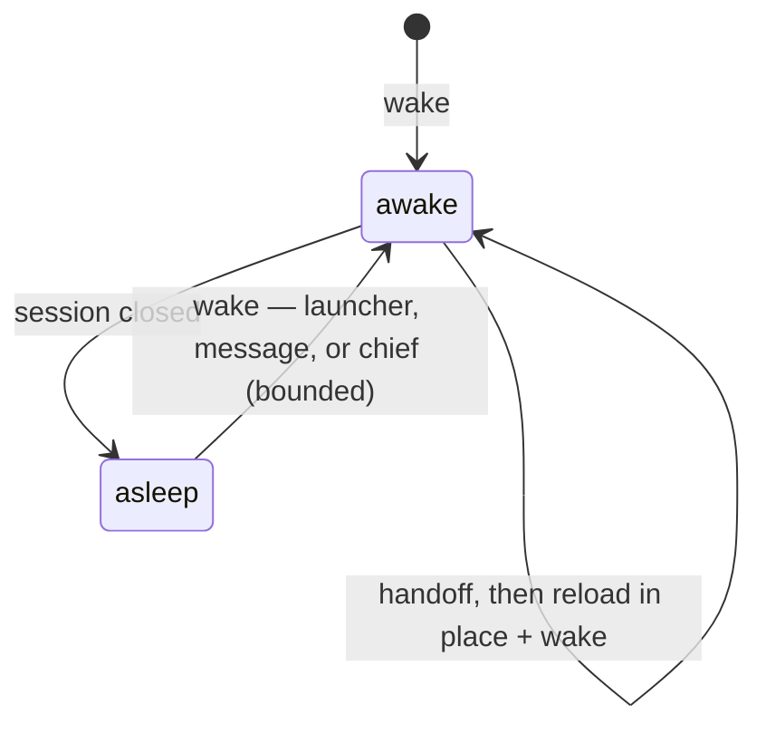
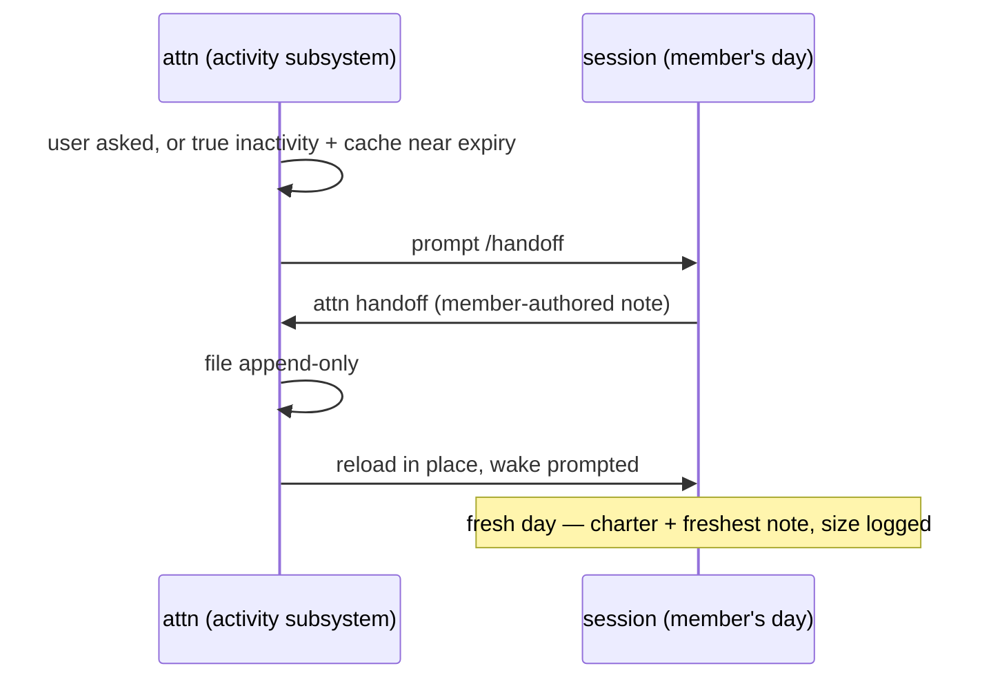

# Plan: the crew primitive

Stage 4 of the
[home–garden–crew arc](2026-08-10-home-garden-crew-arc.md): the crew
hardens from the hand-run skill simulation into the daemon, at the home,
behind the fence. A **crew member** is a durable identity — charter,
handoff line, recognition address — whose sessions are its days. The
simulation (`~/.attn/crew/`, `/wake`, `/handoff`) has run since
2026-08-06: three members, 18 filed handoffs, ~1,500 lines of
member-authored continuity. This plan is what that experience says the
primitive is; revised 2026-08-13 from Victor's annotation pass on the
first draft.

## What the simulation proved (receipts)

Seven days of real use settled these; they are constraints now, not
ideas:

- **Identity is the invocation, never the files.** A session is a member
  because it was woken as one. Reading a charter confers nothing. The
  daemon version makes this structural: a binding stamped at launch.
- **Handoffs are append-only letters to the successor**, written by the
  agent at consented closure, in its own words. Never harness narration.
  The freshest note is the wake's priming; older notes are depth on
  demand, never loaded wholesale.
- **The ceremony is the pain.** Handoff, compact, wake, re-orient —
  running the sequence by hand was the worst part of the experiment.
  The primitive's job is to make continuity nearly automatic: attn
  drives the sequencing; the member only writes its letter.
- **A compact is not a nap.** The simulated nap
  (handoff → compact → wake) leaves the harness's compaction summary
  sitting beside the member's own note as competing priming — exactly
  the harness narration the handoff rule exists to keep out. The real
  nap reloads instead: `/handoff`, then attn reloads the session and
  prompts `/wake`, so the member's letter is the only thread. A future
  harness of our own can do fancier things; this is the shape until
  then.
- **Charters change rarely and only by the user's call** — but the
  voice should be the member's. The wish, unmet so far: value-driven,
  opinionated charters — a self the member writes, not a job
  description. Wake guidance should push that way.
- **Plain markdown was load-bearing.** Any agent — claude, codex, a
  future pi host — can be a member because a home is just files. The
  primitive must not break this.

## What the simulation cannot do (why harden)

- The daemon does not know members exist: `agent list`/`peek` cannot say
  "this session is trellis today," and `agent msg trellis` (the
  messaging plan's deferred crew addressing) has nothing to resolve
  against.
- Wake and handoff are manual skill invocations with no state: nothing
  enforces one-session-per-member, nothing records that a member is
  awake, nothing stops a stray session from writing another member's
  home — and nothing prevents an unconsented compact from overwriting a
  day with harness narration before the handoff is written.
- Members never actually sleep. They stay live today only because the
  user never closes them; nothing watches for true inactivity, nothing
  knows when a session's context cache will expire, and nothing tracks
  what a session costs. The lifecycle below needs all three.
- Priming has no budget receipt: the vision asks for logged priming size
  from day one; the skills log nothing.
- Recognition (a later rock) needs a durable address; files can't be
  one. Deferred on purpose; this plan only mints the address.

## Shape

### The lifecycle

The first draft's shape assumed a world where members sleep; today they
never do. The primitive builds that world:

- **Wake is an app surface.** A crew launcher in the app starts a
  member's day. The CLI verb underneath is plumbing for agents and
  skills — the path a chief or another agent uses — not the human
  surface. A member launches in **its own cwd** and carries **awareness
  dirs**: the places its charter is about (the attn member knows where
  attn lives on disk). Both are registry fields; the harness receives
  them natively where it supports extra directories, through priming
  where it does not.
- **Wake primes and teaches.** Priming injects the charter, the
  freshest handoff, and the crew guidance — how to handoff, how the nap
  works, the home's rules — through the launch-guidance path the garden
  primer already rides. Without injected guidance the member does not
  know its own verbs. Priming size is logged (the budget receipt).
- **Handoff completes into a reload.** The sequence is one automated
  motion attn drives, however the handoff started — the user asked, or
  attn prompted it over auto-sleep (true user inactivity — no cursor
  movement, no keypress, measured at the app — plus the session's
  context cache nearing expiry). When the member's handoff call
  succeeds with its note, attn immediately reloads the agent in place
  and prompts the wake. A fresh day, primed by the letter, with no gap
  the user has to bridge.
- **The heartbeat rides user activity.** While the app has user
  activity, attn nudges a member before its context cache expires so
  the cache stays warm — the user is around, so continuity is worth a
  cheap request. Without user activity there is no heartbeat;
  auto-sleep semantics take over.
- **Members live in the sidebar.** Every crew member is always visible
  there, awake or asleep — a sleeping member is one action from waking,
  never something to go find.
- **The activity subsystem extends presence.** The shared
  user-activity system already exists: the app heartbeats
  `set_client_presence` (visibility, dashboard visibility, idle
  seconds) and the daemon folds it into a `PresenceTier` —
  watching / present / away (`internal/daemon/client_presence.go`);
  session-activity generation is its consumer today. The crew
  lifecycle becomes the second consumer and adds what presence lacks:
  per-session context-cache state, session cost, and a measured
  "true inactivity" threshold — the existing 90s presence-idle limit
  is an unmeasured guess tuned for a different purpose, so auto-sleep
  gets its own receipt.

The handoff self-loop fires when the user asks or when attn prompts it
over auto-sleep; the member always writes the note itself. `asleep`
means the session is closed. The wake limit caps every autonomous wake
while the user is away — reload cycles and message-triggered wakes
alike.

### Registry and binding

- **Files stay canonical.** A member's home remains plain markdown on
  disk; the daemon holds the **registry** — member id, charter path,
  home dir, cwd, awareness dirs, active binding — and serves reads. The
  registry is docstore (`core/crew`), the prose is files. This keeps
  the any-agent property and honors one-owner-per-state: the home
  daemon owns the registry; the files are its storage, not a second
  authority.
- **Binding is the identity mechanism.** Wake launches a session with a
  member binding: the daemon stamps it, `agent list`/`peek` display it,
  and the session's writes to the member home are permitted while stray
  writes are refused. **Two agents with the same identity never run at
  once** — one active binding per member, the `profile_roles`
  single-holder pattern as the donor. Parallelism means another member,
  never a second copy.
- **Messaging wakes.** `agent msg trellis` resolves the binding:
  delivered to the live session when the member is awake; otherwise the
  message *wakes the member* and delivers — no wake-then-msg double
  dispatch, no refusal to nobody. A message-triggered wake counts
  against the wake limit.
- **Handoff closes.** `attn handoff` files the note through the daemon
  — append-only enforced — and releases the binding.
- **Fenced.** Every crew verb passes through the stage-2 fence helper:
  home-only until the uplink; outpost sessions get the named error.
- **The garden touches lightly.** Tending is not a crew privilege —
  workers and errand sessions tend seeds too, and that stays. When a
  tender happens to be a crew member, `Tender.Is`'s free-string name
  gains a real registry id to resolve against; the registry never
  becomes a requirement to tend.

## Slices

1. **Registry + binding.** Import `~/.attn/crew/` as the initial
   registry; bind on launch; show the member in `agent list`/`peek`;
   single-holder enforcement; resolve a member tender's name to its
   registry id where one exists (workers keep tending unbound). No
   behavior change for unbound sessions.
2. **Wake.** The sidebar crew surface (members always visible, awake
   or asleep, one action to wake) plus the daemon verb underneath: own
   cwd, awareness dirs, priming injection (charter + freshest handoff +
   crew guidance) with logged size, fence check.
3. **Handoff and the nap.** `attn handoff`: daemon-filed, append-only;
   on success attn immediately reloads the agent in place and prompts
   the wake — one motion, replacing the compact nap.
4. **Activity subsystem + auto-sleep.** Extend the presence system
   with context-cache state and session cost; the inactivity prompt,
   the wake limit, and the heartbeat hang here.
5. **Crew addressing.** `agent msg <member>`: deliver to the live
   session or wake-and-deliver, bounded by the wake limit.
6. **Chief migration.** The chief of staff becomes the first standing
   crew member rather than a special case — its role state
   (`profile_roles`), guidance injection, and ticket identity re-read
   from the registry. Last, because it converts existing behavior.

## Ruled (2026-08-13 annotation pass)

- **Homes stay at `~/.attn/crew/`**, plain hand-editable markdown —
  hand-editability has been part of the trust.
- **No adopting mid-flight sessions.** A running unbound session is
  never woken *into* a member; a member's day starts at launch.
- **The nap reloads; it does not compact.** However the handoff
  started — user-asked or attn-prompted over auto-sleep — a successful
  handoff makes attn immediately reload the agent in place with a wake
  prompted.
- **Messaging wakes a sleeping member** rather than refusing.
- **Agents may wake members** — the chief can run the house's mornings
  — under the wake limit.
- **Files canonical, registry in docstore.**
- **Skills retire into verbs, and the verbs are taught**: wake injects
  the crew guidance, because an agent never told how to handoff cannot.
- **Two handoffs, two axes — never blended.** A seed handoff (garden
  slice 4) is the work item's thread, written by whoever tends it,
  worker or member; a crew handoff is the member's day-line. Both
  stand on their own. The care owed is in the guidance: wake and tend
  instructions name each verb by its axis so an agent never files one
  where the other belongs.
- **Recognition stays out**: its own rock; this plan only gives it the
  address (the member id).

## Open forks

- **The wake limit.** How many autonomous wakes (reload cycles and
  message- or chief-triggered) while the user is away, over what
  window? Needs a receipt: measure what a wake costs — priming size ×
  model — before writing the number. Whatever we pick, we will change
  our mind: the limit ships as a setting with a default, tunable
  without a release, never a constant.
- **Heartbeat policy.** Conta de padaria, list-price arithmetic (not a
  receipt — measure live before hardcoding): a member's day at ~100k
  tokens on Opus-class pricing ($15/M input; cache read 10%; 1h-TTL
  cache write 2×). One heartbeat = one cache read ≈ **$0.15**, at most
  one per quiet hour of user activity → a dollar or two per member per
  working day. Letting the cache lapse and continuing the same session
  = re-writing 100k to cache ≈ **$3.00**, twenty heartbeats' worth.
  Sleeping instead = fresh priming at ~10k tokens ≈ **$0.03** — but
  costs the ceremony and the day's live context. So: heartbeat while
  the user is active (5% of the lapse price), sleep when truly away
  (heartbeating through a long absence buys warmth for nobody). The
  open question is only the edges: the priming-size and wake-cost
  receipts, and whether the heartbeat defaults on.
