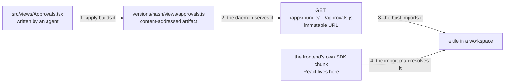
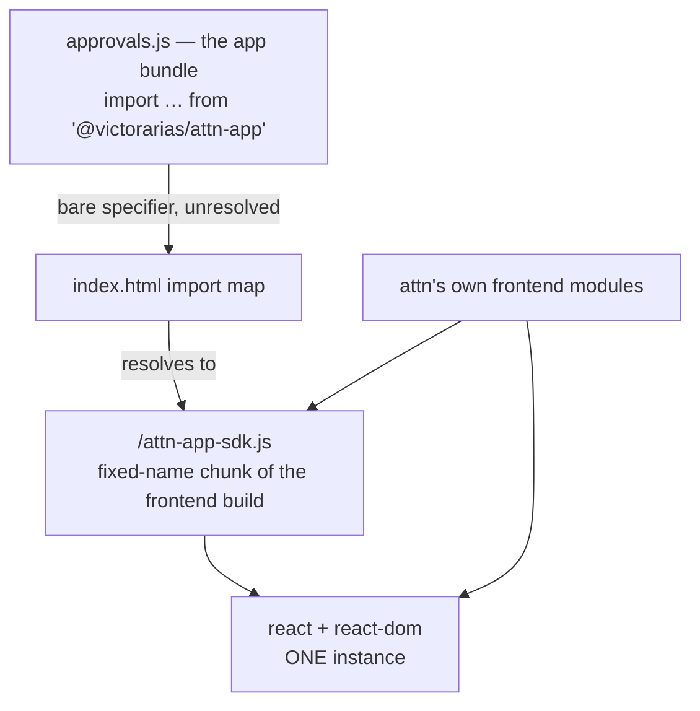
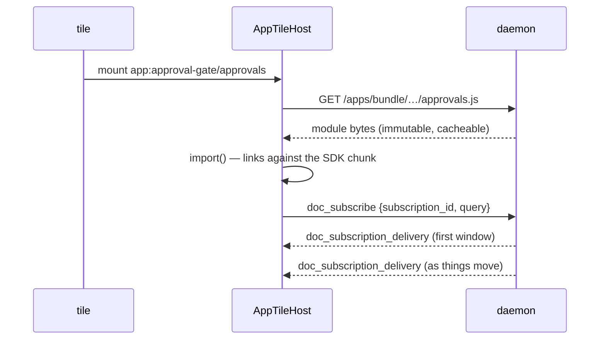

# A5 — UI host and the app SDK

Stage A5 of the extension-platform roadmap
([2026-08-01-extension-platform-roadmap.md](2026-08-01-extension-platform-roadmap.md)),
designed 2026-08-13 with Victor. It builds on A4's registry
([2026-08-06-ext-a4-app-registry-and-runtime.md](2026-08-06-ext-a4-app-registry-and-runtime.md))
and A3.4's delivery shape
([2026-08-05-ext-a3.4-doc-store-positions-and-windows.md](2026-08-05-ext-a3.4-doc-store-positions-and-windows.md)).

The moment it delivers: an agent writes a React component in an app
directory, applies it, docks it in a workspace, and watches it render live
data. Saving the file re-renders it a second later. Breaking it kills that
tile and nothing else.

## The shape

A4 made an app a real thing headlessly — a manifest, a content-addressed
version, a bus consumer, a document namespace, a supervised runtime. A5
gives an app a face. Four seams, end to end:



1. **Views.** An app declares named components in its manifest. The build
   compiles each one for the browser into the same content-addressed
   version directory the handler bundle already lives in.
2. **A bundle URL.** The daemon serves those artifacts over its existing
   HTTP listener at a content-hashed path. Immutable content, immutable
   URL — the vision's "no ESM cache games" as a property, not a rule.
3. **A host.** `WorkspaceDockTile`'s kind switch grows one arm that
   dynamic-imports such a URL and mounts the component behind a
   per-app error boundary.
4. **One SDK, one React.** The component imports exactly one specifier,
   `@victorarias/attn-app`, resolved to the frontend's own module
   instance — so an app's component and attn's UI share a React by
   construction of the build graph.

Everything below is those four seams argued out.

## Gate answers

Victor answered A5's five stage gates on 2026-08-13. The answers, and what
each one implies.

### Mount surface — views, of kind tile

Tiles are the only mount surface A5 builds. Panels, full windows, and
whatever else comes later are foreseen but unbuilt, so the manifest and the
registry must make a second kind an *addition* rather than a rework.

The manifest declares **views**, and a view has a **kind**:

```toml
[[views]]
name = "approvals"                     # [a-z0-9-], unique within the app
kind = "tile"                          # where attn is willing to put it
title = "Pending approvals"            # what the tile header and the
                                       # dock picker show
entrypoint = "src/views/Approvals.tsx"
```

A *view* is what the app declares — a named component with a title. A
*tile* is a place in a workspace layout. Keeping them separate words is what
makes the extension additive. What a later `kind = "panel"` moves, and what
it does not:

```
manifest table    [[views]]              unchanged
registry row      views(name,kind,…)     unchanged
build step        one esm bundle/view    unchanged
artifact layout   views/<name>.js        unchanged
bundle route      /apps/bundle/…         unchanged
error boundary    per-app                unchanged
SDK               hooks + components     unchanged
accepted kinds    {"tile"}               + "panel"      ← one line
host component    AppTileHost            + AppPanelHost ← one component
```

`kind` is optional in app api 1 and defaults to `"tile"`; any other value is
a loud apply-time refusal naming the kinds this attn can mount — the same
discipline `refuseUnknownKeys` already applies to tables, one level down.
The frozen declaration records the *resolved* kind, so a default that
changes later cannot rewrite what an old version meant. The scaffold writes
`kind = "tile"` explicitly anyway: a field nobody sees is a field nobody
extends.

Rejected: a `[[tiles]]` table, with `[[panels]]` beside it later. It is
additive at the TOML level and nowhere else — two tables mean two registry
shapes, two wire shapes and two lookups, and the day a component can be both
a tile and a panel there is nothing to change but everything to move.

**How a view reaches a layout.** `tile_kind` stays a daemon-opaque string
(`internal/workspacelayout` accepts any non-empty value today); an app view
docks as `app:<app>/<view>`. The frontend's tile renderer parses that prefix
and falls through to the app registry; the `app:` prefix is reserved from
this stage on, so a future built-in kind cannot collide with an app's name.
The dock picker lists every enabled app's views beside the built-in kinds,
which is the only new placement UI A5 needs.

**The user places a tile; an app never does.** An app that could dock itself
could rearrange a layout its user arranged, and that is a door with no way
back. When an app needs a person, it says so through the notification
surface, and the person decides where to look.

**What a view receives.** A view is a function of where it sits. Without
that, every tile of an app shows the same thing wherever it is docked, so
the host passes four values as props:

```tsx
type ViewProps = {
  workspaceId: string       // which workspace this tile is in
  sessionId: string | null  // the session that workspace has selected
  tileId: string            // stable for the life of this docked tile
  params: string            // what the user typed when docking, "" if none
}
```

The first three are ambient — the host already knows them and they cost
nothing. `params` is the user's, and it is what makes two tiles of one view
show different things. It is the same shape the markdown tile already uses,
where `tile_params` holds a file path the layout never interprets.

A view that wants one says so, and the dock picker asks:

```toml
[[views]]
name = "approvals"
kind = "tile"
title = "Pending approvals"
entrypoint = "src/views/Approvals.tsx"
params = { label = "Repository", placeholder = "victorarias/attn" }
```

Declared, the picker shows a one-line text field with that label before it
docks; omitted, it shows nothing and `params` arrives empty. The string is
opaque to attn — no schema, no types, no picker over the app's own
documents — exactly as a markdown tile's path is opaque to the layout. An
app that needs richer input renders it inside its own tile, which it can
already do.

**An app may be all view and no handler.** A4's manifest refuses an app with
no `[[subscribe]]` block — "declares no subscriptions, so nothing would ever
run it". That refusal becomes: an app must declare *something that runs* —
a subscription or a view. A tile that only reads the document store is a
legitimate whole app.

### SDK packaging — one source, materialized locally

No npm publish. attn materializes the package on the machine, the way A4
already materializes the pinned TypeScript compiler under
`<data-dir>/apps/toolchain` behind an `flock`.

What A4 shipped is types-only and does not stretch to A5: `GenerateSDK()`
in `internal/appbuild/codegen.go` builds an ambient module declaration by
Go string concatenation and writes it into the app as `src/attn-app.d.ts`.
That was exactly right for a handler contract of five interfaces. A5's SDK
has runtime code — hooks, components, a JSX runtime — and a Go string
literal is not where React components live.

So the SDK becomes **one TypeScript source in this repo**, at
`sdk/attn-app/`, with two consumers that cannot disagree:

```
sdk/attn-app/                       one source
  ├─ frontend: app/ resolves @victorarias/attn-app to it
  │            → the SDK's runtime IS the app's own modules
  │              (same React, same tokens, same socket)
  └─ binary:   tsc --emitDeclarationOnly → //go:embed
               → attn app apply materializes it on disk
```

What lands on disk, and where:

```
<data-dir>/apps/
├── toolchain/                      A4: pinned tsc, behind an flock
├── sdk/<sdk-hash>/                 A5: types only, no JavaScript
│   ├── package.json                exports map
│   └── index.d.ts                  emitted from sdk/attn-app/
└── <app>/versions/<content-hash>/
    ├── bundle.js                   A4: the handler bundle
    └── views/approvals.js          A5: one per declared view

approval-gate/                      the app directory
├── attn-app.toml                   [[views]] lives here
├── node_modules/@victorarias/
│   └── attn-app -> <data-dir>/apps/sdk/<sdk-hash>
├── src/handlers.ts
├── src/views/Approvals.tsx
└── src/attn-app.d.ts               deleted by apply (A4 leftover)
```

Materialization takes the toolchain's existing lock; the symlink is what
makes `tsc` and an editor resolve the specifier with no network and no
install.

One source means the types an author checks against and the code that runs
are written once, so they cannot drift within a build. They can still skew
*between* builds — the `.d.ts` reaches an app through the CLI binary and the
runtime reaches a tile through the frontend, and an old binary beside a new
app is a real state. That skew is already fenced: the daemon↔frontend leg
fails explicitly on `ProtocolVersion`, and a bundle typechecked against an
SDK export the running frontend does not have fails ESM linking by name at
mount (see below). Neither produces a silent wrong answer, which is the
property that matters.

The materialized package is **types only**. Nothing needs the JavaScript on
disk: every specifier an app imports from the SDK is external at bundle time
and supplied by the host at mount time (next section). That is also what
keeps a rolled-back version honest — an old bundle runs against today's SDK
rather than a copy of the SDK frozen inside it.

**The specifier is `@victorarias/attn-app`.** The roadmap's `@attn/ext` name
predates the extension→app rename and is retired here; A4 already shipped
this specifier into every scaffolded app, and a published npm package can
still take it over later without touching app code. The subpath
`@victorarias/attn-app/jsx-runtime` is added by this stage.

**A4's ambient file is user state and gets retired properly.** Every app
scaffolded or applied since A4 has a `src/attn-app.d.ts` in its tree, and
leaving it beside a real package gives every app two conflicting
declarations of one module. `attn app apply` deletes it when it materializes
the package, and says so on stdout. It is attn's own generated file, carrying
attn's own do-not-edit header, so deleting it is retiring a generated
artifact rather than touching an author's work.

### Shared React — one specifier, one instance

The requirement: attn's frontend and a dynamically imported app bundle must
use one React. Two instances share no hook dispatcher, so the second one's
`useState` throws on the first render — a failure that looks like a bug in
the app's code and is not.

The proposal, as a module graph. Every path to React converges because both
arms are chunks of the *same* frontend build:



In the order the mechanism runs:

**1. An app's code never names React.** The scaffold's tsconfig sets
`"jsx": "react-jsx"` with `"jsxImportSource": "@victorarias/attn-app"`, so
TSX compiles to `import { jsx } from "@victorarias/attn-app/jsx-runtime"`.
Hooks come from the SDK's own re-exports. React is therefore not a specifier
an app can write, which is stronger than asking authors not to write it: an
`import ... from "react"` in an app fails to typecheck, because there is no
`react` in the app's `node_modules` and nothing declares it.

Re-exported by name, not by `export *`: `useState`, `useEffect`,
`useMemo`, `useCallback`, `useRef`, `useReducer`, plus `Fragment` and the
`ReactNode`/`ReactElement` types. What is not re-exported is what the
platform has not promised, and the list grows when a real view needs an
entry — the same rule as the component slice below. `export *` would make
React's whole surface the SDK's contract and every React upgrade an SDK
contract change.

**2. The build marks the SDK external.**

```
bun build src/views/Approvals.tsx \
  --target browser --format esm \
  --external @victorarias/attn-app \
  --external @victorarias/attn-app/jsx-runtime
```

Nothing else is external: an app's own npm dependencies belong in its
artifact, unchanged from A4 — a version has to be the whole of what runs, or
a rollback is not a rollback.

**A view is not one file.** The entrypoint is where the build starts, not
what it contains: `bun build` follows the whole import graph out of it —
local modules, npm dependencies, anything they pull in — and emits one
artifact.

```
src/views/Approvals.tsx      entrypoint, declared in the manifest
  ├─ ../lib/format.ts        ordinary local import
  ├─ ../lib/rules.ts         ← both land inside views/approvals.js
  └─ date-fns                an npm dep, bundled too
```

One view is one file is one URL is one `import()`. Two views that share a
helper each carry their own copy, because a shared chunk would mean a
second URL, a second fetch and a load order to get right — real machinery
bought against a duplication nobody has measured. If a receipt ever shows
that cost mattering, splitting is an artifact-layout change and nothing
above it moves.

**3. The document's import map resolves the two specifiers.** `index.html`
carries a static import map:

```html
<script type="importmap">
  { "imports": {
      "@victorarias/attn-app": "/attn-app-sdk.js",
      "@victorarias/attn-app/jsx-runtime": "/attn-app-sdk-jsx.js" } }
</script>
```

Both targets are fixed-name Rollup entries the frontend build emits (an
`entryFileNames` override for those two chunks; every other chunk keeps its
hash). Because they are entries of the same build as the app frontend,
React lands in a chunk both import — one instance, from the shape of the
build graph, not from a rule someone has to remember. In `pnpm dev` the same
two paths are served by Vite from the SDK source.

An import map is realm-wide: it resolves bare specifiers for every module
loaded into the document, including one fetched from another origin. That is
the entire reason this mechanism is worth its build-config cost — the host
does nothing at mount time, and the app bundle is honest ESM that imports
the specifier it says it imports.

It also buys a loud failure for free:

```
     import { useQuery } from "@victorarias/attn-app"

     import map     → SyntaxError: The requested module does not
     (proposed)       provide an export named 'useQuery'
                      ↑ names the binding, before any app code runs

     globalThis     → const { useQuery } = globalThis.__attn
     (rejected)       useQuery is undefined; it fails later, elsewhere
```

**4. The bundle is imported by URL.** The daemon serves

```
GET /apps/bundle/<app>/<content-hash>/<view>.js
```

from the mux that already carries `/ws` and `/health`
(`initHTTPServer`, `internal/daemon/daemon.go`). Content-addressed, so
`Cache-Control: public, max-age=31536000, immutable` is honest, and a new
version is a different URL rather than a cache to bust. The frontend calls
`import(/* @vite-ignore */ url)`.

Two mechanics this needs and does not have today:

- **CORS.** The frontend runs at `tauri://localhost` and the daemon at
  `http://127.0.0.1:<wsPort>`; module scripts are always fetched in CORS
  mode, and the daemon sets no `Access-Control-Allow-Origin` header
  anywhere today. The bundle route sets one. Nothing else on the mux
  changes.
- **A WKWebView receipt.** The WebSocket to that origin works from the
  packaged app, but a cross-origin *module import* is a different fetch
  path. This is the first thing slice 3 verifies live, and it is the one
  place where the fallback matters: if WKWebView refuses, the host fetches
  the bytes and imports a `blob:` URL instead. The import map still applies
  (same realm), the SDK still resolves, and the only losses are HTTP
  caching and an explicit `URL.revokeObjectURL` on unmount. The interface
  above the host does not change either way.

**Cost of a fetch that hangs: 10s.** Borrowed from A4's measured
`appRuntimeConnectWait`, which covers a much slower operation — spawning a
compiled Bun host, connecting over a unix socket and importing a bundle —
measured end to end at 41–77ms. A localhost read of a few kilobytes is
orders of magnitude under that. It is a tripwire: a healthy tile never
learns it exists, and a tile that hits it says so by name in the boundary.

There is deliberately **no bundle size cap**. Nothing has been measured yet
that would justify a number, and a cap picked from nothing is a landmine
that fires on the first legitimately large view. What A5 does instead is
make the number visible: `attn app apply` already prints the handler
bundle's byte count, and slice 1 extends that to every artifact a version
holds. A limit arrives if a receipt ever asks for one.

**What a React upgrade costs.** Nothing, for anything already built —
that is the point of the externals. React is never inside an app's
artifact, so upgrading attn's React means rebuilding attn's frontend and
every stored app version picks up the new one on its next mount, unrebuilt.
An app applied a year ago runs on today's React.

Two exposures, both narrow, both loud:

```
runtime    a bundle uses what the SDK re-exports: 6 hooks + Fragment.
           those signatures have survived every React major so far.
           if one ever goes, the ESM link error names it at mount.

types      ReactNode / ReactElement are React's own types, so a major
           that redefines them can fail an app's NEXT `attn app apply`
           typecheck — with a filename and a line. no running tile
           breaks; nothing on disk becomes invalid.
```

The re-export list being short is what keeps both narrow: `export *` would
have made every React major an SDK contract change.

### The design-system slice

The gate: inventory what the first real view needs to look native, re-export
exactly that, grow on demand.

The honest inventory first. **attn has no component library**, and the two
halves of that fact pull in opposite directions:

```
app/src/App.css        128 custom properties on :root
                       ├─ 80 --color-*   inherited by any mounted view
                       ├─ 12 --font-*    ← free. ships nothing.
                       └─ 32 --syntax-*

51 feature stylesheets 55 distinct button class names
                       ← the receipt for why Button is component #1
```

**Tokens come for free.** A view mounts inside the app's DOM, so every
`var(--color-*)`, `var(--font-*)` and `var(--syntax-*)` already resolves.
The SDK documents the token names and ships nothing, because there is
nothing to ship — they are inherited. This is most of "looks native" at zero
cost, and it is why the component list can be short.

**The initial components**, chosen against what C2's approval panel actually
draws — a list of pending prompts, each approvable or rejectable with
feedback:

| Component | Why it is in the first slice |
| --- | --- |
| `Button` | 55 hand-rolled variants is the receipt: this is the control every view would get wrong, and the one users notice. Variants `primary` / `secondary` / `danger`. |
| `TextArea`, `TextInput` | Reject-with-feedback. Focus rings and font stack are where a foreign input announces itself. |
| `List`, `ListRow` | The shape every attn panel repeats: a selectable row with a title, a meta line and trailing actions. |
| `EmptyState` | The state a live-query view is in most of the time. Getting "nothing pending" wrong makes a working tile look broken. |
| `Markdown` | `MarkdownReader` in read-only mode (no annotation layer). Agent-written content is markdown; without this every view ships its own renderer, and it is by far the heaviest thing to duplicate. |

Two deliberately left out of the first slice, with reasons worth recording:

- **A spinner.** A permanently animating element is a battery bug in a
  window that is open all day. Loading states are text.
- **`RelativeTime`.** "3m ago" is what makes a queue readable, and it is
  also a repaint loop waiting to happen. If it lands, it lands as one
  shared 30s ticker (the coarsest interval that bounds staleness under a
  minute, which is the finest granularity the string can express), running
  only while the window is visible, re-rendering only rows whose formatted
  string actually changed. Until a view needs it, an absolute timestamp
  with a `title` costs nothing and repaints never.

**The growth rule**, stated so nobody has to ask: a component enters the SDK
when a second view needs it, or when its absence would make the first view
look foreign. Not before.

### Protocol envelopes

Three families, added once, generic. Every one is a shape the protocol
already has a precedent for; A5 adds no new correlation scheme to the
frontend.

**1. Live queries on the WebSocket.** `doc_subscribe` exists but is
IPC-only and connection-scoped — the connection *is* the subscription:

```go
// today, internal/daemon/documents.go
func handleDocSubscribe(conn net.Conn, req) {
  for {
    wait()                     // one-slot wake channel
    encode(conn, delivery)     // one conn, so no id is needed
  }                            // returns when the caller hangs up
}
```

A WebSocket client multiplexes one connection, so a subscription needs an
identity of its own:

```go
// proposed: the loop keeps its shape, the writer becomes a sink
type subscription struct {
  wake chan struct{}           // unchanged (one slot)
  sink func(delivery)          // the only new seam
}

ipcSink = func(d) { encode(conn, d) }                    // today's bytes
wsSink  = func(d) { send(client, docDelivery{id, d}) }   // new
```

The one-slot wake channel, the per-delivery declaration re-read and the
held-revisions map are untouched. Four envelopes carry it:

- `doc_subscribe` gains `subscription_id` (client-minted) — required on the
  WS, refused on IPC where it would be meaningless.
- `doc_unsubscribe { subscription_id }` — the way out for the way in.
- `doc_subscription_delivery { subscription_id, delivery, as_of_seq, order,
  upsert }` — A3.4's delivery, verbatim, plus the id. The client rule is
  unchanged: render `order`, take bodies from `upsert` or cache, forget the
  rest.
- `doc_subscription_ended { subscription_id, code, error }` — carrying
  A3.4 Stage 2's codes (`collection_undefined`, `collection_redeclared`),
  which is what lets the host tell "kill the tile" from "resubscribe".

Frontend pattern: **not** `daemonPendingRequests`. That module correlates a
one-shot command with one `*_result`; a subscription is a stream.

```
useDaemonSocket.ts  switch (event.type)
  ├── case 'pty_output': …
  ├── …
  └── default → daemonFsEvents            existing
              → daemonBusEvents           existing
              → daemonDocumentEvents      ← A5, one line here
                  Map<subscription_id, handlers>
                  first delivery settles the subscribe promise;
                  every later one is pushed
```

Scope, stated as the non-boundary it is: the namespace a subscription reads
is supplied by the host from the mount's identity and never by the view, so
an app cannot accidentally read another app's documents. The daemon takes
the namespace as given — the WebSocket client is attn's own frontend, at the
same trust level as the IPC socket, and pretending otherwise would be
theatre on a local single-user surface.

That containment is an assumption about *who holds the socket*, not a
property of the protocol, and it is worth naming because it is the thing
that stops being true first. A relayed subscription over the hub, or an
`attn web` client that grows tiles, puts a namespace on the wire from
somewhere the frontend did not compose — and at that point the daemon has to
decide what a client is allowed to read, which is a trust-model change
rather than "relay one more message". Whoever lifts the remote restriction
inherits that question, and it is theirs to answer, not A5's to have
answered.

**A tripwire with a receipt: 64 live subscriptions per client.** Measured
against Victor's production database on 2026-08-13: seven live workspaces,
of which three hold exactly one docked tile and four hold none. A view can
reasonably open more than one query, so the healthy ceiling is single
digits and this is an order of magnitude past it. A client that reaches it
gets a refusal naming the limit, its value and the ask — never a silently
dropped subscription.

**2. The app UI registry.** The frontend has to know what is mountable. The
initial-state snapshot gains `apps`, one entry per registered app: name,
title, enabled, current version id and content hash, and its views (name,
kind, title). A4's `app.version.changed`, `app.enabled.changed` and
`app.removed` facts have **no projection today** — A5 adds them to
`wireProjections`, re-pushing that snapshot. That is the whole reload
mechanism (below), and it is why A4 could leave those facts unprojected.

**3. `app_command` / `app_command_result`.** A view that can only read is a
way in without a way out. The envelope is generic — `{ app, command,
payload }` in, `{ success, error, payload }` back — and it settles through
`daemonPendingRequests`, the existing one-shot pattern, because that is
exactly what it is.

Dispatch reuses everything A4 built rather than adding a second path:

```
attn-app.toml   [[commands]] name = "approve"
      ↓ codegen
handlers.ts     type Handlers = {
                  "subscribe:doc.changed": …   A4
                  "command:approve": …         ← A5, missing = tsc error
                }
      ↓ apply → sidecar
runtime         ordinary dispatch: same invocation log, same timeout,
                same drain on version flip, same failure attribution
```

The alternative considered: no command at all, with a view acting by writing
a document its own handler reacts to on `document.changed`. It needs zero
new machinery and it is a real composition — but it makes the view the
authority for the app's invariants, and it turns every action into a
durable write even when the app wants to refuse it. The envelope is three
protocol shapes and one dispatch key; adding it here is what "envelopes are
added once" meant.

Protocol drill per repo policy: `main.tsp` → `make generate-types` →
`internal/protocol/constants.go` + `ProtocolVersion` increment, and the
third lockstep spot, `PROTOCOL_VERSION` in `app/src/hooks/useDaemonSocket.ts`
(241 as of this writing). Taken per slice; numbers renumber at each main
sync, and the tree is authoritative.

The three app facts are published today and read by nobody on the wire, so
they sit on `TestEveryProjectedFactReachesTheWire`'s named-consumer list.
Adding their projections means moving them off it and giving each one the
one-line fixture naming the events it sends — the live table drives both
tests, so a projection cannot land unnoticed.

## What an author writes

The whole design, from the side that matters — this is the scaffold's
example, and the shape slice 6 proves live:

```tsx
// src/views/Approvals.tsx
import { useQuery, useCommand, Button, List, ListRow, EmptyState }
  from "@victorarias/attn-app"
import type { ViewProps } from "@victorarias/attn-app"
import { formatAge } from "../lib/format"        // an ordinary local import

export default function Approvals({ params }: ViewProps) {
  const { docs, live } = useQuery("requests", {
    filters: [
      { field: "status", op: "==", value: "pending" },
      ...(params ? [{ field: "repo", op: "==", value: params }] : []),
    ],
    sort: { field: "updated_at", desc: true },
    limit: 20,
  })
  const approve = useCommand("approve")

  if (!docs.length) {
    return <EmptyState title="Nothing waiting" hint={live ? "" : "reconnecting"} />
  }
  return (
    <List>
      {docs.map((d) => (
        <ListRow key={d.id} title={d.body.prompt} meta={formatAge(d.body.updated_at)}>
          <Button variant="primary" onClick={() => approve({ id: d.id })}>
            Approve
          </Button>
        </ListRow>
      ))}
    </List>
  )
}
```

No React import, no daemon, no subscription lifecycle, no seq — and one
tile of it per repository, from a string the user typed. `useQuery`
holds A3.4's contract entirely: it renders `order`, takes bodies from
`upsert` or its cache, forgets the rest, and on remount resubscribes with
`have: {id: rev}` so the daemon sends only what changed while the tile was
gone. A delivery invariant it cannot satisfy — a body it does not hold and
was not sent — makes it resubscribe without `have`, invisibly.

## The host

One arm on an existing switch, and everything below it is new:

```
WorkspaceDockTile
└── body, by tile.tileKind
    ├── 'markdown'          → MarkdownBody          existing
    ├── 'browser'           → BrowserTileBody       existing
    ├── 'notebook'          → NotebookTile          existing
    └── 'app:<app>/<view>'  → AppTileHost           ← the only new arm
        └── AppViewBoundary                per-app error boundary
            └── <Module.default />         imported at mount
```

Mount is one fetch and one subscribe:



## What the user sees

### A view that fails

Three failures, three different things on screen, each naming a way back:

| What broke | What the tile shows | The way back |
| --- | --- | --- |
| The bundle will not load — fetch failed, timed out, 404 after an artifact was removed | The app name, the version, and a Retry action | Retry; the message names `attn app status <name>` |
| The module will not link — an SDK export the bundle expects is gone (a rollback to a version built against an older SDK is the realistic case) | The missing binding's name, plus "this view was built against a different SDK" | Re-apply the app |
| The component throws while rendering | The error message, from a per-app boundary | Reload action on the tile |

In all three the tile stays where it is. It never vanishes and it never
takes the frame with it: undocking is the user's act, and a component that
removes itself from a layout the user arranged is a worse defect than the
one that put it in that state. The boundary is not a retry loop either —
React does not re-render a caught boundary on its own, so a component that
throws every render throws once and waits. The rest of the workspace, every
other tile, and every other app's tiles keep running — that is what "dies at
its boundary" means, and the exit proof demonstrates it deliberately.

Repeated failures feed A4's existing auto-disable posture rather than a new
one: the host reports a caught render error as an app invocation with the
version that served it, so a view that crashes on every mount is visible in
`attn app logs` and countable by the same machinery that counts handler
failures.

### A view whose app is gone

Disabling or removing an app does not disturb the layouts its views sit in.
The tile renders a named placeholder — "approval-gate is disabled" for the
first, "approval-gate is not installed here" for the second — each with the
way back, and neither ever disappears on its own. Undocking stays the
user's act.

Removing an app whose views are docked in several workspaces leaves those
placeholders behind until the user closes them, which is what A4's "removing
deletes the registry row and nothing else" already implies. A placeholder
that names what is missing is a thing a person can act on; a tile that
silently vanished from a workspace they arranged is not.

### Reload

The signal already exists — A5 only projects it:

```
author saves Approvals.tsx
  → attn app dev            200ms debounce            A4
  → attn app apply          new content hash          A4
  → version flip            publishes                 A4
      app.version.changed {app, from, to}
  → wireProjections         re-pushes the apps snapshot   ← A5
  → AppTileHost             mounted version id moved,
                            remount at the new URL        ← A5
```

No watcher, no polling, no new recurring work: a quiet system publishes
nothing and the host repaints nothing.

Remount, not HMR, per the vision: the old module is dropped, the new URL is
imported, the component is mounted fresh. Because a view is a projection of
live queries, re-hydrating costs one round trip carrying only what changed.

**The badge, and when a remount waits.** An unfocused tile remounts
immediately — that is the sub-second edit-to-screen loop the stage exists
for. A tile that currently holds focus does not: remounting under someone's
cursor loses whatever they typed. It shows a reload badge in the tile header
and remounts on blur, or immediately if they click the badge. The badge is
static; nothing about it animates.

### Remote endpoints

**Tiles are not rendered for remote apps in v1**, because neither half of a
view is reachable across the relay:

```
bundle        HTTP GET against the daemon holding the artifact
              the hub relays WebSocket messages, it does not proxy HTTP

subscription  a live query against the daemon holding the collection
              the relay forwards facts already published on the remote;
              it does not carry a subscription's window back
```

This is safe rather than merely deferred, because nothing renders blank: the
dock picker lists the **local** daemon's registry, so a remote app's views
are never offered and no layout can name one. An app installed on a remote
endpoint runs headless — which works today, since A4's ruling ships
`attn-app-runtime` to hub-managed remotes. A view docked in a *remote
workspace* still renders: the app, its bundle and its documents are all
local, and the workspace is only where the tile sits.

Lifting the restriction later means relaying the two things above — a
bundle fetch and a subscription — and it is a hub change, not an A5 rework.

`attn web` (the daemon's embedded mobile client at `/`) is a different UI
with no workspace layout and no tiles. Out of scope, and unaffected.

## Delivery

Epic branch `epic/ext-a5`, following A4: slices merge promptly into the
epic without betting main, the epic is rebased onto main after each landed
slice, and main takes one fully-reviewed merge at the end with live
verification receipts. A5 changes existing behavior in the app — the tile
renderer and the frontend build — which is the question that decides epic
versus direct-to-main.

| # | Slice | Verification |
| --- | --- | --- |
| 1 | Views are declared and built | CLI tier |
| 2 | The SDK becomes a package | CLI tier + frontend typecheck |
| 3 | The host mounts | Full app |
| 4 | Live queries on the wire | Full app |
| 5 | Acting, looking native, being teachable | Full app |
| 6 | Exit proof | Full app + recording |

**1. Views are declared and built.** Manifest `[[views]]` with `kind` and
the optional `params` declaration, the "a view counts as something that
runs" relaxation, browser-target bundling per view entrypoint (whole import
graph, one artifact), artifact layout (`bundle.js` beside `views/<name>.js`),
and the version hash extended to cover **every** artifact plus the
declaration — a view-only edit must mint a new version, and hashing the
handler bundle alone would reuse a row whose views moved.
*CLI tier:* self-contained build work with no daemon or app surface; unit
tests plus running the built binary against a real app directory, per the
"cheapest tier that covers the change" rule.

**2. The SDK becomes a package.** `sdk/attn-app/` source; the frontend
resolves the specifier to it; `tsc --emitDeclarationOnly` in the build;
`//go:embed` of the declarations; materialization under
`<data-dir>/apps/sdk/<hash>` behind the toolchain lock; the `node_modules`
symlink; retirement of A4's `src/attn-app.d.ts` and the `GenerateSDK()`
string builder; `jsxImportSource` in the scaffold's tsconfig.
*CLI tier plus the frontend's own typecheck:* a scaffolded app with a `.tsx`
view typechecks against the materialized package with no network and no npm
install.

**3. The host mounts.** The daemon's bundle route with CORS and immutable
caching; the `apps` snapshot and the three projections; the import map and
the two fixed-name frontend chunks; `AppTileHost` behind a per-app error
boundary; the `app:<app>/<view>` tile kind, the dock picker entry and its
param field; the `ViewProps` the host passes; the disabled/removed
placeholders; remount on version change; the reload badge and its focus
rule.
*Full app, non-production profile:* this is where the WKWebView cross-origin
module import is proven or the blob fallback is taken, and where the
boundary UX is exercised by breaking a view on purpose.

**4. Live queries on the wire.** The four subscription envelopes and their
protocol bump; the daemon-side refactor of `handleDocSubscribe` into a
sink-driven subscription shared by IPC and WS; `daemonDocumentEvents.ts`;
the per-client subscription tripwire; the SDK's `useQuery` including
resume-by-`have` across a remount.
*Full app:* a docked view rendering live documents, a write from
`attn doc put` landing in it, and a remount resending only what changed.

**5. Acting, looking native, being teachable.** `[[commands]]`, the command
envelope and its dispatch key; the component slice; `attn app new`
scaffolding a working view with its example; the scaffold's `AGENTS.md`
gaining the view half; the changelog fragment (A5 is the first
user-visible stage); glossary entries for **view** and **tile**.

**6. Exit proof.** The roadmap's exit criterion run live and recorded on the
epic→main PR:

```
write a view → apply → dock it → live data appears
             → edit under `attn app dev` → it remounts
             → break it → the boundary holds, everything else runs
             → fix it → it comes back
```

With a recording, per repo policy — A5 is a visible change.

Verification tiers follow the repo rule rather than the directory: slices 3
through 6 touch protocol, persisted state, projections and UI, so they need
a running non-production app. Slices 1 and 2 have no app-observable
behavior at all and carry unit tests plus the binary run, with the live
proof arriving at slice 3.

## Open questions

Two left, and neither blocks slice 1.

1. **Is a raw string the right param?** The dock picker asks for one line of
   text with the app's label on it, and the app parses whatever comes back.
   It is the smallest thing that makes two tiles of one view differ, and it
   matches what the markdown tile already does with a path. What it cannot
   do is offer the user a *choice* — a repository picker, a list of the
   app's own collections — because attn does not know what the string
   means. The alternative is a declared param type the picker can render,
   which is a schema, a validator and a widget per type. Worth a look at the
   real thing before deciding: a text field is judged by how it feels to
   dock a tile, not by how it reads here.
2. ~~**React's types, across a React major.**~~ **Settled in slice 2 by this
   doc's own proposal: re-export.** The SDK re-exports `ReactNode` and
   `ReactElement`, which are React's own. A major that redefines them can
   fail an app's next `attn app apply` typecheck — loudly, with a filename,
   and with no running tile affected. The alternative considered was the SDK
   declaring its own aliases, which decouples the app from React's type
   churn and costs a small, permanent translation layer that has to stay
   honest. Revisit the first time the break actually fires.

## Slice 2 as-built

The SDK became a package as designed; four things the design did not name, all
found by building it.

**React's declarations have to reach the app.** The SDK re-exports React's
types and a view's JSX resolves its `JSX` namespace through them, so an app
cannot typecheck a `.tsx` without `@types/react` on disk. It is pinned beside
the compiler (`ReactTypesVersion`, installed into `<data-dir>/apps/toolchain` by
the same `bun install` behind the same lock) and the materialized package
reaches it through one relative symlink — `apps/sdk/<hash>/node_modules` →
`apps/toolchain/node_modules` — which is also how `csstype` resolves, because
tsc follows a symlink to its real path before resolving anything further. The
pin is checked against the frontend's own lockfile by
`TestReactTypesPinMatchesTheFrontend`: the declarations an author checks against
have to be the declarations the running frontend provides.

**One React comes from the workspace, not from a build flag.** `sdk/attn-app` is
a package of the frontend's pnpm workspace (`packages: ['.', '../sdk/attn-app']`)
and the frontend depends on it as `workspace:*`, so the specifier resolves with
no vite alias and no tsconfig path — and both arms link to one copy in the pnpm
store, which is what makes them one module instance. That property is asserted
directly rather than argued: `app/src/appSdk.oneReact.test.ts` compares the
SDK's exported hooks with React's by identity, and pins the re-export list.

**The declarations are generated and committed.** `//go:embed` reads files from
the Go tree, so `tsc --emitDeclarationOnly` writes `internal/appbuild/sdkdist/`
and those files are committed the way `generated.go` is. `make generate-sdk`
emits them, `make check-sdk` fails on a stale copy (by `git status`, so a
declaration the emit newly produces cannot pass as an untracked file), and the
frontend CI job runs it.

**A third specifier: `jsx-dev-runtime`.** Bundlers reach for the development JSX
runtime unless told to build for production — measured: `bun build` of a `.tsx`
entrypoint emits `import … from "@victorarias/attn-app/jsx-dev-runtime"` with no
`--production`. The SDK carries it so a default flag cannot fail a build. A
stored version is immutable and content-addressed, so there is no per-run
dev/prod split: slice 1 should build views in production mode, and slice 3's
import map should carry the entry regardless, since a bundle that names it must
still link.

**What slice 2 deliberately did not build.** `useQuery` and `useCommand` (slices
4 and 5), the components (slice 5), the import map and the fixed-name frontend
chunks (slice 3). An app's *handler* bundle still carries no SDK JavaScript and
is not built with `--external`, so a handler importing an SDK **value** fails at
bundle time with a resolution error naming the specifier — unchanged from A4,
where the ambient declaration had no JavaScript either.

## Slice 4 as-built

The four envelopes and `useQuery` landed as designed. Four things the design did
not name, all found by building it.

**The refusal and the ending are one envelope.** The design gave
`doc_subscription_ended` the post-acceptance codes and left refusals implicit. On
a multiplexed connection a refusal has to name the subscription it refused, and
`command_error` cannot — so every way a subscription is not running arrives as
`doc_subscription_ended`, told apart by code: `invalid_query`,
`undeclared_collection` and `subscription_limit` refuse one that never started,
`collection_undefined` and `collection_redeclared` end one that did. A client has
exactly one place to learn a query is not being served.

**The subscribe never goes through the outbound queue.** The frontend queues a
command issued while the socket is down and flushes it on the next open — and the
connect handler also re-sends every wanted subscription, because the daemon lost
them all with the old connection. Both together would send one subscription
twice, and the second is refused as an id already open. So a subscribe is sent
only over an open socket; when there is none, the registry alone carries it and
the connect handler is what sends it. That registry is also what makes a resume
correct across a reconnect rather than only across a remount: each subscriber is
asked for its `have()` at re-send time, not at first subscribe.

**`useQuery`'s cache outlives its mount, so it needs a bound.** Resume-by-`have`
means the bodies survive unmount, which makes them a module-level cache keyed by
the query's identity. It keeps 64, the same receipt as the per-client
subscription tripwire: a client cannot hold more live queries than that, so
retaining more caches is retaining for tiles that cannot all exist. Eviction
costs one fuller first delivery and nothing else, which is why this bound is the
one limit in the slice that is deliberately silent.

**The host composes the namespace; the SDK cannot.** `sdk/attn-app` is its own
package and cannot import the app's socket, so it exports the seam
(`AppViewRuntimeProvider`, `AppViewRuntime`) and `AppTileHost` implements it —
handing over `app/<app>` and the frontend's `subscribeDocuments`. That is what
makes "a view cannot read another app's documents" structural: a view is given a
namespace, and there is no call that takes one.

## Slice 5 as-built

Commands, the components, and the scaffold landed as designed. Four departures
and receipts, all found by building it.

**Kind is structure, not a prefix on a key.** The design drew
`"subscribe:doc.changed"` beside `"command:approve"` in one flat map, and the
first build of this slice shipped half of that — raw patterns for subscriptions,
a `command:` prefix for commands — defended by a proof that the two can never
collide, since a colon appears in neither an event pattern nor a command name.
That proof is a rule someone can break later. A bundle exports one map per kind
instead: `subscriptions`, keyed by the raw event pattern, and `commands`, keyed
by the bare name. The manifest already separates the kinds, so the bundle mirrors
it rather than re-encoding kind as a string convention, codegen derives a typed
group per kind — tsc enforces "every declared command has a command-shaped
handler" structurally — and the sidecar indexes the map its dispatch context
names (a fact arrived → `subscriptions`; a command envelope → `commands`),
constructing no keys at all. Collision becomes inexpressible rather than
proven-absent.

Invocation **labels** are a separate thing: what `attn app logs` shows, so it
names the kind — `command:approve`, `subscribe:ticket.*`, `view:approvals`. They
have no dispatch meaning, which is what makes labelling every kind free.

Existing installed apps export the flat shape and stop dispatching until they are
re-applied. Pre-release, with no app installed anywhere but a dev profile, that
costs one `attn app apply` and buys a shape that cannot be got wrong.

**A command carries at most 256KB in either direction.** The same limit as a
document body, and for the same reason: the payload lands in the sidecar's
single-threaded loop and in the invocation log's error text. Over it, the
refusal names the command, the app, the limit and the ask, and says where
larger data belongs — a document, which is the surface built to hold it.

**The frontend waits longer than the daemon.** `APP_COMMAND_TIMEOUT_MS` is 75s
against the daemon's 60s dispatch budget. That ordering is the whole point: a
handler that never yields is abandoned by the daemon, which knows which app and
which command froze the shared loop, and its refusal reaches the view naming all
three. A frontend that gave up first would replace that with "the daemon did not
answer", which no agent can act on. A failed command never advances the app's
stall clock — that clock exists for a consumer pinning the durable log's
retention floor, and a docked tile pins nothing, so clicking must not be able to
disable a healthy app.

**Component styles live in the app, not in the SDK.** A CSS import inside the
SDK's rollup entry emits an asset the import map's three fixed-name chunks
cannot link, so the components emit `attn-app-*` class names only and
`app/src/components/appViews/appSdkComponents.css` — imported by `AppTileHost` —
carries every rule, over attn's own tokens. A test asserts both directions of
that pairing, so a component that grows a class without a rule, or a rule with
no component, fails rather than shipping unstyled. The shipped slice is Button,
TextInput, TextArea, List, ListRow, EmptyState and Markdown; nothing in them
animates, which is why the spinner and the relative-time label the design
excluded stay excluded.

## Out of scope

- Panels, windows, and any mount kind other than tiles. Designed for, not
  built.
- An app placing its own tile. Ruled out on purpose, not deferred: a layout
  the user arranged is theirs.
- Declared param *types* — a picker the dock UI can render. v1 asks for one
  opaque string.
- Splitting shared code across view bundles. Each view carries its own copy
  until a receipt says otherwise.
- Running app code on remote endpoints, and rendering remote apps' views
  locally.
- HMR with state preservation. Remount, per the vision.
- Chat-time generative UI over registered components.
- A component library for attn's own UI. The SDK's slice is for apps; the
  55 hand-rolled button classes are a real debt and consolidating them is
  not this stage's job.
- Hook claims (C1), workflows and signals (B2), the approval gate (C2) —
  which is the first real consumer of everything above.
