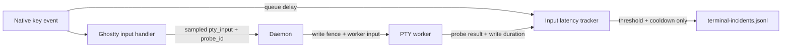

# Terminal input latency diagnostics

Typing stalls that are unrelated to resize currently leave no durable evidence. Measure the two boundaries a user can feel without turning every keystroke into a log line.

## Boundary contract

- A real terminal keyboard input may carry an optional `probe_id` on `pty_input`. At most one probe is started per runtime in the sampling window.
- After that input has passed the session write fence and the PTY backend has accepted it, the daemon returns `pty_input_probe_result` to the requesting client with the same runtime id and probe id, success, and daemon write duration in microseconds.
- The browser uses its own monotonic clock for both ends of the round trip, so local and remote sessions need no clock synchronization.
- The Ghostty keyboard filter also compares `KeyboardEvent.timeStamp` with `performance.now()`. This covers time spent waiting for the browser main thread before the PTY send begins.
- Healthy key-delay and round-trip samples live only in a small in-memory ring. A sample crossing 250 ms becomes a terminal incident; repeated incidents for the same runtime and stage are suppressed for 30 seconds.

## Work

- [x] Add the optional probe fields and result event to the generated protocol, including remote relay routing and a protocol-version bump.
- [x] Add a bounded in-memory input latency tracker with sampling, clock normalization, cooldown, and an on-demand dump.
- [x] Mark Ghostty keyboard input as user input, measure event-queue delay, and complete sampled probes in the daemon socket event path.
- [x] Reuse the capped terminal incident writer so only threshold crossings touch disk.
- [x] Cover the tracker, daemon acknowledgement, protocol generation, and affected terminal input wiring with focused tests.
- [x] Build and exercise the change in an isolated packaged app profile; verify healthy typing creates no incident records.

## Verification

- `make test-quick`
- `pnpm --dir app exec vitest run --silent=passed-only --reporter=dot` (251 files, 2776 tests, 20 skipped)
- `pnpm --dir app exec tsc --noEmit`
- Packaged `input-latency` profile preflight at protocol 241
- Native macOS typing into an isolated shell reached the PTY worker and echoed; healthy typing added no input incident

## Surface check

- CLI: no new command; `attn debug incidents` already reads the selected bounded file.
- Daemon and app: both change; live packaged verification required.
- Protocol: TypeSpec, generated Go/TypeScript, constants, and version move together.
- Linux: daemon additions use only portable Go primitives and must pass the existing Go build/tests.
- Plugins and SDK: no shared plugin or SDK surface.
- Docs: this plan and a terminal changelog fragment cover the user-visible diagnostic behavior.
