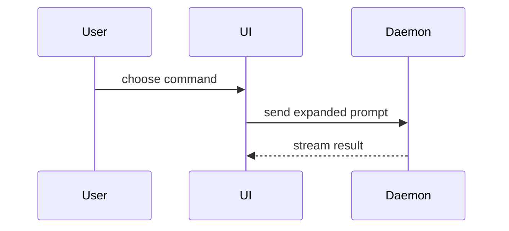

# Showing instead of narrating

Guidance for any text another reader must understand — a ticket
description, a delegation brief, a comment, a status report, workspace
context, a PR body. The reader is catching up, not watching you work: a
paragraph makes them reconstruct the shape in their head; a sketch hands
it to them. Pick the smallest view that makes the key point clear, keep
the prose beside it short and plain, and skip the preamble.

Every surface this text lands on renders markdown and mermaid, so all of
these forms work everywhere.

- Show logic or an algorithm as pseudocode:

```text
on(save)
  if content is unchanged
    return cached result
  write new content
  return fresh result
```

- Show runtime control flow as a call tree:

```text
submitForm
  createSession
    persistPrompt
    launchAgent
  navigateToSession
```

- Show UI structure as a component tree, including state and module
  boundaries that matter:

```tsx
<SessionPage> (apps/example/src/routes/session.tsx)
  useSessionEvents()
  <SessionToolbar>
    <RunSkillButton> (packages/ui)
```

- Show file responsibility or a broad refactor as a shallow file tree:

```text
src/
├── commands/       # parses user actions
├── sessions/       # owns session state
└── transport/      # sends API requests
```

- Show component interaction, control flow, or data flow with Mermaid:



- Use `diff` when the point is what changes and the surrounding shape
  already exists. Match the diff shape to the topic — a component
  change, a file-layout change, a call-tree change, a state or
  control-flow change:

```diff
 on(save)
-  write content
+  if content is unchanged
+    return cached result
+  write new content
+  invalidate cache
```

- Show the whole block when most of it is new, when omitted context
  would hide ownership or order, or when the reader needs a copyable
  target shape.

- For something too dense for these forms — a layout, a visual
  comparison — write a markdown document or a Present manifest instead
  of forcing it into a comment: see [markdown.md](markdown.md) and
  [present.md](present.md).

Place each visual next to the short text it supports. Keep only the
calls, files, states, and boundaries needed to answer the reader's
actual question. You may use one of these forms, you may use several;
it is unlikely you will use all of them. Use your judgement and don't
overwhelm the reader.

(The forms and examples are adapted from the MIT-licensed `show-me`
skill in humanlayer/skills.)
