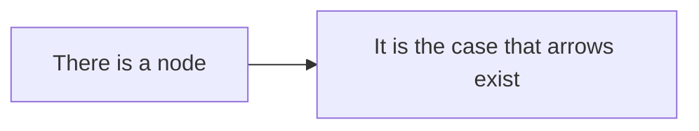

# There is a heading here

The prose in this paragraph is clean and there is nothing to object to in it.

```go
// There is a consideration that must be given to this comment, and it is
// inside a code fence, so the gate never reads it.
func makeADetermination() {}
```



    There is an indented code block here and it must be considered.

Reading `internal/daemon/session_state.go` is fine, and so is a link to
[the plan doc](docs/plans/there-is-a-consideration-that-must-be-given.md)
whose target never lints even though its name says otherwise.

<!-- There is an HTML comment here that must be given consideration. -->

| Column | There is a header |
| --- | --- |
| a value | it is the case that cells are not prose |

Visit https://example.com/there-is-a-url-that-must-be-considered for more.
